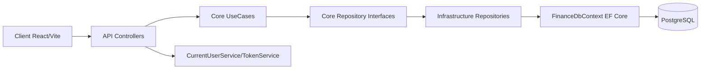

# Project Map — Finances

> Gerado em: 19 de maio de 2026
> Por: 🗺️ Project Mapper Agent

## 1. Visão geral

- **Propósito**: Aplicação de finanças pessoais para controle de entradas/saídas, investimentos, metas e custos veiculares. O sistema combina gestão operacional (transações e categorias) com recursos de planejamento (simuladores e metas).
- **Tipo**: Web app full-stack (SPA + API REST), com docker-compose para ambiente local.
- **Status**: Em desenvolvimento ativo (MVP evolutivo, com várias migrations e módulos funcionais).

## 2. Stack técnica

### Frontend

- Framework: React 19 (Vite 7)
- Linguagem: JavaScript (ESM)
- Build/Bundler: Vite
- Estilo: Tailwind CSS 4 + classes utilitárias
- Estado: React Hooks (estado local em componentes)
- Testes: Não identificados

### Backend

- Plataforma: .NET 10
- Framework: ASP.NET Core Web API
- ORM: Entity Framework Core 10
- Banco: PostgreSQL (Npgsql)
- Autenticação: JWT Bearer + BCrypt para hash de senha
- Testes: Não identificados

### Infra/DevOps

- Containerização: Docker + Docker Compose (db, backend, frontend)
- CI/CD: Não identificável no repositório ([? a confirmar com o PO])
- Hospedagem: Indícios de deploy frontend em Vercel (arquivo vercel.json) + backend conteinerizado

## 3. Arquitetura

- **Estilo**: Monólito modular (frontend separado do backend, backend em projetos API/Core/Infrastructure)
- **Padrão**: Próximo de Clean Architecture / Layered (Controllers -> UseCases -> Repositories interfaces -> Infrastructure)
- **Camadas identificadas**: API, Core (Domain, DTOs, UseCases, contratos), Infrastructure (EF DbContext, Repositories concretos, Services)
- **Direção de dependências**:



## 4. Estrutura de pastas (visão alto nível)

```text
.
|- docker-compose.yml           # Orquestra db + backend + frontend para desenvolvimento
|- client/                      # SPA React com dashboards e módulos de negócio
|  |- src/components/           # Views/modais por feature (Dashboard, Investimentos, Metas, Veículo, Login)
|  |- src/services/             # Config de endpoints e autenticação no front
|  |- src/util/                 # Formatação de moeda/data/horas
|  |- vercel.json               # Rewrite para SPA no deploy
|- server/                      # Backend .NET
|  |- API/                      # Endpoints REST, Program.cs, configuração HTTP/JWT
|  |- Core/                     # Domínio, casos de uso, contratos e DTOs
|  |- Infrastructure/           # EF Core, DbContext, migrations, repositórios e serviços concretos
|  |- Finance.slnx              # Solução da aplicação backend
```

## 5. Features implementadas

- [x] Autenticação (login JWT) e registro administrativo — server/API/Controllers/AuthController.cs + client/src/components/LoginView.jsx — status (ok)
- [x] Gestão de movimentações financeiras (CRUD, filtros, período, resumo mensal, saldo acumulado) — server/API/Controllers/Movimentacao/MovimentacoesController.cs + client/src/components/DashboardView.jsx + client/src/components/TransactionModal.jsx — status (ok)
- [x] Gestão de categorias personalizadas — server/API/Controllers/CategoriasController.cs + client/src/components/CategoryManagerModal.jsx — status (ok)
- [x] Gestão de investimentos (CRUD, aporte, saque, atualização de saldo) — server/API/Controllers/Investimento/InvestimentosController.cs + client/src/components/InvestmentsView.jsx — status (ok)
- [x] Simulador de juros compostos no frontend — client/src/components/InvestmentsView.jsx — status (com bugs aparentes)
- [x] Gestão de metas/lista de desejos com cálculo de esforço em horas — server/API/Controllers/Metas/MetasController.cs + client/src/components/WishListView.jsx — status (ok)
- [x] Gestão de veículos com alerta de revisão por KM e custos vinculados a movimentações — server/API/Controllers/Veiculo/VeiculosController.cs + client/src/components/VehicleView.jsx — status (ok)
- [x] Suporte a movimentações recorrentes (mensal/semanal) — client/src/components/TransactionModal.jsx + Core/Domain/Movimentacao + UseCases de Movimentacao — status (ok)

## 6. Convenções detectadas

- **Naming**: C# em PascalCase para classes/métodos públicos e camelCase para variáveis/injeções; frontend em camelCase para funções/estado e PascalCase para componentes.
- **Sufixos**: Controller, UseCase, Repository, DTO, Service.
- **Idioma**: Predominantemente PT-BR no domínio, nomes de entidades e textos de UI; termos técnicos em inglês (Controller, UseCase, DTO).
- **Organização**: Backend layer-first com separação por responsabilidade; frontend híbrido com componentes orientados a feature.

## 7. Pontos fortes ✅

- Separação clara de responsabilidades no backend (API/Core/Infrastructure).
- Autenticação JWT implementada e centralização de usuário atual via CurrentUserService.
- Filtros de isolamento por usuário no EF Core (query filters) em entidades-chave.
- Modelagem de domínio cobrindo múltiplas frentes financeiras (movimentação, investimentos, metas, categorias, veículos).
- UX frontend com módulos visuais bem definidos para cada contexto de negócio.

## 8. Dores e riscos detectados ⚠️

- 🔴 **Segurança**: segredos sensíveis presentes em arquivos de configuração no workspace (ex.: JWT key, AdminKey, credenciais de banco em appsettings.json/.env).
- 🔴 **Segurança**: política CORS permite qualquer origem (AllowAnyOrigin), reduzindo proteção de superfície para clientes não confiáveis.
- 🟠 **Qualidade**: ausência de testes automatizados (frontend e backend), elevando risco de regressão.
- 🟠 **Confiabilidade**: simulador de investimentos pode dividir por zero quando taxa = 0, gerando resultado inválido.
- 🟡 **Manutenibilidade**: README do frontend ainda é template padrão do Vite, sem documentação funcional do produto.
- 🟡 **Consistência**: sinal de endpoint potencialmente órfão no frontend (API_VEHICLE_URL para /manutencoes, enquanto API principal usa /veiculos).

## 9. Recomendações de próximos passos 🚀

1. Priorizar hardening de segurança: remover segredos de arquivos versionáveis, rotacionar chaves e adotar secrets por ambiente.
2. Corrigir CORS para whitelist explícita com AllowedOrigins em vez de AllowAnyOrigin.
3. Implementar suíte mínima de testes (use cases críticos no backend + smoke/component tests no frontend).
4. Corrigir edge cases do simulador (taxa zero e validações de entrada) para evitar valores NaN/Infinity.
5. Atualizar documentação raiz/produto com setup real, arquitetura e fluxos de autenticação.

## 10. Glossário do domínio

- **Movimentação**: registro financeiro de entrada ou saída.
- **Entrada/Saída**: tipo de transação que aumenta/diminui saldo.
- **Meta**: objetivo financeiro com valor alvo.
- **Investimento**: aplicação financeira com operações de aporte/saque.
- **Aporte**: adição de capital em investimento.
- **Saque**: retirada de capital de investimento.
- **Saldo acumulado**: saldo histórico anterior ao mês/ano consultado.
- **Categoria**: classificação da movimentação (ex.: transporte).
- **Veículo**: ativo com custo de manutenção e alertas por quilometragem.
- **Alerta KM**: ponto de manutenção/revisão por distância rodada.
