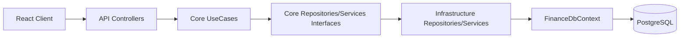

# Project Map — Finances

> Gerado em: 19 de maio de 2026
> Por: 🗺️ Project Mapper Agent

## 1. Visão geral

- **Propósito**: Aplicação de finanças pessoais para controlar entradas/saídas, investimentos, metas e custos de veículo em uma única interface. Combina operação do dia a dia com planejamento financeiro de médio/longo prazo.
- **Tipo**: Web app full-stack (SPA React + API REST .NET) com ambiente local via Docker Compose.
- **Status**: Em produção inicial/MVP evolutivo (projeto ativo, migrations frequentes e melhorias recentes de DevEx).
- **Idioma do produto**: PT-BR.

## 2. Contexto de Negócio (quando detectável)

- **Persona principal**: Rafael (dono do produto e usuário principal), com uso pessoal para gestão financeira diária e metas.
- **Dor que resolve**: Dificuldade de consolidar orçamento mensal, investimentos e custos veiculares de forma integrada, com visibilidade de saldo e esforço para metas.
- **KPIs implícitos**:
  - `saldo-acumulado` e `resumo mensal` (saúde financeira mensal).
  - `total em juros` e `patrimônio final estimado` no simulador (planejamento de investimento).
  - `total gasto` por veículo e alerta de revisão por KM (custo operacional do veículo).
  - Sinais operacionais com `/health` e `/ready` para disponibilidade/prontidão da API.
- **Restrições comerciais**: Sem requisitos formais de SLA/compliance explícitos no repositório; há preocupação prática com disponibilidade de deploy e consistência de dados financeiros.
- **Status**: Parcialmente detectável (persona confirmada por contexto da sessão; sem documento formal de produto) `[? a confirmar com o PO]`.

## 3. Stack técnica

### Frontend

- Framework: React 19.
- Linguagem: JavaScript (ESM).
- Build/Bundler: Vite 7.
- Estilo: Tailwind CSS 4 + classes utilitárias.
- Estado: React hooks com estado local/levantado no `App`.
- Testes: Não identificados.

### Backend

- Plataforma: .NET 10.
- Framework: ASP.NET Core Web API.
- ORM: Entity Framework Core 10 + Npgsql.
- Banco: PostgreSQL 16.
- Autenticação: JWT Bearer (validação server-side) + BCrypt para hash/verificação de senha.
- Testes: Não identificados.

### Infra/DevOps

- Containerização: Docker + Docker Compose.
- CI/CD: Não identificado no repositório (não há workflows em `.github/workflows`) `[? a confirmar com o PO]`.
- Hospedagem: indício de frontend em Vercel (`vercel.json`) e backend conteinerizado.
- Observabilidade: endpoints separados `/health` e `/ready`; logs estruturados no fluxo de auto-migration (startup).

## 4. Arquitetura

- **Estilo**: Monólito modular (client separado; backend em API/Core/Infrastructure).
- **Padrão**: Layered/Clean-like (`Controllers -> UseCases -> Interfaces -> Repositories EF`).
- **Camadas identificadas**:
  - API: controllers, autenticação, middleware HTTP, health/readiness.
  - Core: domínio, DTOs, interfaces de repositório/serviço e use cases.
  - Infrastructure: DbContext, configurações EF, migrations e implementações de repositórios/serviços.
- **Direção de dependências**:



## 5. Estrutura de pastas (visão alto nível)

```text
.
|- docker-compose.yml              # orquestra db, backend e frontend para dev
|- docs/runbooks/                 # runbooks operacionais (ex.: migrations em produção)
|- client/                        # SPA React
|  |- src/components/             # telas e modais por feature
|  |- src/services/               # endpoints API + autenticação
|  |- src/util/                   # formatadores de moeda/data/horas
|- server/                        # backend .NET
|  |- API/                        # Program, controllers, config HTTP/JWT
|  |- Core/                       # domínio, DTOs, use cases e contratos
|  |- Infrastructure/             # EF Core, migrations, repositórios e serviços
|  |- Finance.slnx                # solução backend
|- .specify/                      # memória/constituição e templates de engenharia
```

## 6. Features implementadas

- [x] Autenticação JWT e login de usuário — `server/API/Controllers/AuthController.cs` + `client/src/components/LoginView.jsx` — **status: ok** — KPI: taxa de autenticação bem-sucedida `[? não instrumentado]`.
- [x] Registro administrativo com `X-Admin-Key` — `server/API/Controllers/AuthController.cs` — **status: ok técnico / risco de segurança** — KPI: novos usuários `[? não instrumentado]`.
- [x] Movimentações financeiras (CRUD, filtros por mês/ano/período, saldo acumulado e resumo) — `server/API/Controllers/Movimentacao/MovimentacoesController.cs` + `client/src/components/DashboardView.jsx` — **status: ok** — KPI: `saldo-acumulado`, `resumo`.
- [x] Simulação de transações e aplicação em lote no dashboard — `client/src/components/DashboardView.jsx` — **status: ok com risco de parcialidade em falha de lote** — KPI: variação de saldo projetado.
- [x] Categorias personalizadas — `server/API/Controllers/CategoriasController.cs` + `client/src/components/CategoryManagerModal.jsx` — **status: ok** — KPI: distribuição de despesas por categoria.
- [x] Investimentos (CRUD, aporte, saque, atualização de saldo) — `server/API/Controllers/Investimento/InvestimentosController.cs` + `client/src/components/InvestmentsView.jsx` — **status: funcional com risco de integridade transacional** — KPI: saldo total investido.
- [x] Simulador de juros compostos — `client/src/components/InvestmentsView.jsx` — **status: com bug conhecido** (taxa zero gera divisão por zero/valor inválido) — KPI: patrimônio final estimado.
- [x] Metas/lista de desejos com cálculo de esforço em horas — `server/API/Controllers/Metas/MetasController.cs` + `client/src/components/WishListView.jsx` — **status: ok** — KPI: horas necessárias por meta.
- [x] Gestão de veículos com alerta de revisão por KM e custos associados a movimentações — `server/API/Controllers/Veiculo/VeiculosController.cs` + `client/src/components/VehicleView.jsx` — **status: ok** — KPI: total gasto por veículo e alertas pendentes.
- [x] DevEx de startup e operação — `server/API/Program.cs` + `server/Dockerfile` + `docs/runbooks/migrations-prod.md` — **status: ok** (auto-migration em Development, `/health` e `/ready` separados, runbook para produção) — KPI: tempo de recuperação de ambiente/dev.

## 7. Convenções detectadas

- **Naming**: PascalCase para classes/métodos C# e componentes React; camelCase para variáveis/estado.
- **Sufixos**: `Controller`, `UseCase`, `Repository`, `Service`, `DTO`.
- **Idioma do código**: Domínio e UI em PT-BR; termos técnicos em inglês.
- **Organização**: Backend layer-first (por responsabilidade técnica); frontend majoritariamente feature-oriented em `components`.
- **Padrões de erro**: uso de exceções + respostas HTTP diretas (`BadRequest(ex.Message)`, `StatusCode(500, ...ex.Message)`).
- **Padrões de log**: logs estruturados no startup de migrations; baixa cobertura de logs em erros de controller.

## 8. Pontos fortes ✅

- Evolução clara de DevEx: API sobe em Development sem depender de migration manual.
- Separação de `/health` (liveness) e `/ready` (readiness + conectividade de banco).
- Boa cobertura funcional para um app pessoal (movimentações, investimentos, metas, veículos).
- Uso consistente de `decimal` e `HasPrecision(18,2)` para valores monetários.
- Isolamento por usuário em nível de consulta (query filters no EF).

## 9. Dores e riscos detectados ⚠️

- 🔴 **Constitution I (Bounded Architecture) violada**: `Core` depende de BCrypt (`server/Core/Core.csproj` e `server/Core/Domain/Usuario.cs`), quebrando pureza da camada de domínio.
- 🔴 **Constitution II (Security by Default) violada**: segredos em arquivos versionados e reais (`server/API/appsettings.json` com `Jwt:Key`, `AdminKey`, connection string; `.env` com credenciais).
- 🔴 **Constitution II (Security by Default) violada**: CORS com `AllowAnyOrigin()` em `server/API/Program.cs`, ignorando allowlist explícita para produção.
- 🟠 **Constitution III (Quality Gates Executáveis) violada**: não há testes automatizados identificáveis (frontend/backend), inviabilizando gate de testes e cobertura mínima no PR.
- 🟠 **Constitution III (Quality Gates Executáveis) violada**: não há pipeline de CI visível no repositório para enforcement de build/lint/test.
- 🟠 **Constitution IV (Data Integrity) violada**: operações críticas de aporte/saque/remoção de investimento não usam transação explícita entre múltiplos repositórios (`RealizarAporteUseCase`, `RealizarSaqueUseCase`, `RemoverInvestimentoUseCase`), com risco de estado parcial.
- 🟡 **Constitution IV (Data Integrity) violada**: uso de `DateTime.Now` em `RemoverInvestimentoUseCase`, contrariando exigência de UTC para datas trafegadas/persistidas.
- 🟡 **Constitution V (Operability/Observability Segura) parcialmente violada**: baixa sinalização operacional acionável em falhas de controller (muito retorno com `ex.Message` para cliente e pouca telemetria estruturada no backend).
- 🟡 **Constitution II (Security by Default) risco de exposição**: mensagens de exceção retornadas diretamente em vários endpoints podem vazar detalhes internos.
- 🟢 **Norma complementar (Idempotência - SHOULD)**: endpoints financeiros críticos não apresentam mecanismo de deduplicação/idempotency key.
- 🟢 **Norma complementar (Audit Trail - SHOULD)**: não há trilha auditável explícita (quem/quando/operação/recurso) para alterações financeiras.
- 🟢 **Qualidade funcional**: simulador de juros compostos divide por taxa e quebra para taxa 0%.
- 🟢 **Manutenibilidade**: `client/README.md` permanece template padrão Vite e não documenta fluxos reais do produto.

## 10. Armadilhas conhecidas 🪤

> Bugs recorrentes, gotchas e padrões escondidos que outros agentes/devs precisam saber.

- Em Development, o problema antigo de "API não subir sem migration manual" foi mitigado: agora há auto-migration com retry no startup; em Production continua obrigatório rodar migration manual conforme runbook.
- `/ready` pode responder `503` em Development enquanto houver pending migrations ou indisponibilidade de banco, mesmo com processo da API no ar.
- Simulador de investimentos quebra para taxa `0` porque usa fórmula com divisão por `rateDecimal` sem branch especial.
- Operações de investimento podem deixar inconsistência se a segunda gravação falhar (ex.: atualizou investimento, falhou ao registrar movimentação) por ausência de transação explícita.
- `API_VEHICLE_URL` aponta para `/api/v1/manutencoes`, mas o fluxo ativo usa `/api/v1/veiculos`; variável legada pode confundir manutenção futura.

## 11. Recomendações de próximos passos 🚀

1. Corrigir violações 🔴 imediatamente: remover segredos versionados (rotacionar chaves) e aplicar CORS por allowlist real.
2. Restaurar fronteira arquitetural do Core: mover BCrypt para adapter/service em Infrastructure e manter domínio puro.
3. Implementar transações explícitas nas operações financeiras multi-escrita (aporte/saque/remoção com estorno) e padronizar UTC em 100% dos use cases.
4. Criar quality gates automatizados (build backend/frontend, lint frontend, testes) com pipeline de CI e política de cobertura no PR.
5. Endurecer observabilidade segura: logs estruturados para falhas relevantes (sem PII), sanitizar mensagens de erro de resposta e instrumentar KPIs essenciais.

## 12. Glossário do domínio

- **Movimentação**: lançamento financeiro de entrada ou saída.
- **Entrada/Saída**: impacto positivo/negativo no saldo.
- **Saldo acumulado**: saldo histórico anterior ao mês consultado.
- **Meta**: objetivo financeiro com valor alvo.
- **Investimento**: aplicação financeira com eventos de aporte/saque/rendimento.
- **Aporte**: incremento de capital em investimento.
- **Saque/Resgate**: retirada de capital de investimento.
- **Categoria**: classificação de movimentação para análise.
- **Veículo**: entidade para controle de custos e manutenção.
- **Alerta KM**: limiar de quilometragem para revisão.
