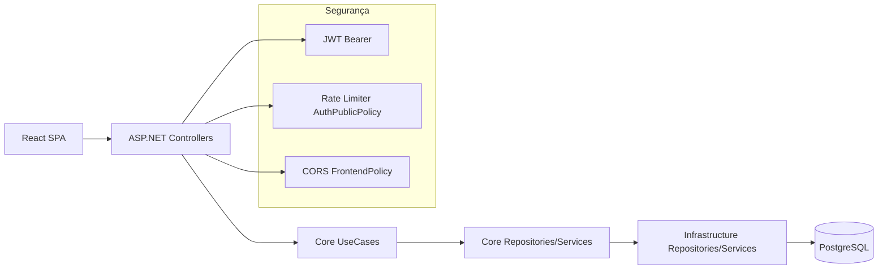
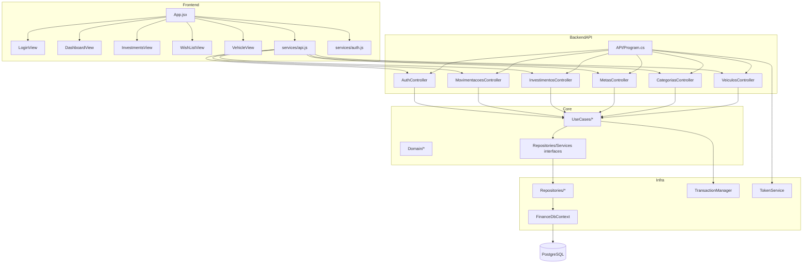

# Project Map — Finances

> Gerado em: 25 de maio de 2026
> Por: 🗺️ Project Mapper Agent

## 1. Visão geral

- **Propósito**: Aplicação web de finanças pessoais para controle de caixa mensal (entradas/saídas), carteira de investimentos, metas e custos de veículos em uma experiência única para uso diário.
- **Tipo**: Web app full-stack (SPA React + API REST .NET), com operação local por Docker Compose.
- **Status**: Projeto ativo em produção caseira, com ciclo recente de hardening de segurança concluído para auth pública (SEC-014) e riscos residuais de governança/qualidade.
- **Idioma do produto**: PT-BR (domínio e UI), com termos técnicos em EN.

## 2. Contexto de Negócio (quando detectável)

- **Persona principal**: Rafael (único dev, PO e usuário) — evidência em briefing de retomada de segurança.
- **Dor que resolve**: Consolidar gestão financeira pessoal (gastos, metas, investimento e manutenção de veículo) sem depender de múltiplas planilhas/apps.
- **KPIs implícitos detectáveis no código/UI**:
  - Saldo mensal e acumulado (`/api/v1/movimentacoes/resumo`, `/saldo-acumulado`).
  - Evolução de patrimônio no simulador de juros compostos.
  - Total gasto por veículo e alerta de revisão por quilometragem.
  - Saúde operacional via endpoints `/health` e `/ready`.
- **Restrições comerciais**:
  - Capacidade de execução limitada (5h/semana, time de 1 pessoa).
  - Produção em servidor caseiro com custo/complexidade operacional restritos.
- **Status**: Contexto parcialmente formalizado e consistente com os briefings de segurança; sem PRD de produto dedicado `[? a confirmar com o PO]`.

## 3. Stack técnica

### Frontend

- Framework: React 19.2.
- Linguagem: JavaScript (ESM).
- Build/Bundler: Vite 7.
- Estilo: Tailwind CSS 4 (utilitário).
- Estado: hooks React com estado local/levantado em `App.jsx`.
- Testes: não identificados (sem arquivos test/spec e sem script `test` no `package.json`).

### Backend

- Plataforma: .NET 10.
- Framework: ASP.NET Core Web API.
- ORM: EF Core 10 + Npgsql.
- Banco: PostgreSQL 16 (compose).
- Autenticação: JWT Bearer + BCrypt para hash/verificação de senha.
- Testes: não identificados (solution contém apenas API/Core/Infrastructure).

### Infra/DevOps

- Containerização: Docker + Docker Compose.
- CI/CD: não identificado (sem workflows em `.github/workflows`).
- Hospedagem:
  - Frontend com indício de deploy estático (Vercel rewrite para SPA).
  - Backend em container .NET com healthcheck em `/ready`.
- Observabilidade:
  - Endpoints `/health` e `/ready` separados.
  - Telemetria estruturada de rejeição no rate limiter de auth pública.

## 4. Arquitetura

- **Estilo**: Monólito modular (backend em 3 projetos + client separado).
- **Padrão**: Clean-like/layered (`API -> UseCases/Core -> Interfaces -> Infrastructure`).
- **Camadas identificadas**:
  - `server/API`: composição, middlewares, autenticação, controllers HTTP.
  - `server/Core`: domínio, contratos, DTOs e use cases.
  - `server/Infrastructure`: DbContext, migrations, repositórios e serviços concretos.
  - `client/src`: telas por feature, serviços HTTP e utilitários.
- **Direção de dependências**:



## 5. Estrutura de pastas (visão alto nível)

```text
.
|- docker-compose.yml                 # orquestra db/backend/frontend em dev/local
|- docs/
|  |- adr/                            # decisões arquiteturais (ex: SEC-014)
|  |- briefings/                      # contexto de negócio e ciclos
|  |- runbooks/                       # operação (migrations, sync pós-rewrite)
|  |- ux-reviews/                     # avaliação de UX/acessibilidade
|- specs/
|  |- 001-eliminar-criticos-seguranca # spec/plan/tasks/checklists do ciclo de segurança
|- client/
|  |- src/components/                 # views/modais por feature
|  |- src/services/                   # contratos HTTP + auth local
|  |- src/util/                       # formatadores
|- server/
|  |- API/                            # Program + controllers HTTP
|  |- Core/                           # domínio + use cases + interfaces
|  |- Infrastructure/                 # EF/migrations/repos/services
|  |- Finance.slnx                    # solução backend (3 projetos)
|- .specify/
|  |- memory/constitution.md          # princípios de engenharia do projeto
|  |- audits/                         # auditorias de segurança/validação
```

## 6. Features implementadas

- [x] **Autenticação e sessão JWT** — `server/API/Controllers/AuthController.cs`, `server/Infrastructure/Services/TokenService.cs`, `client/src/components/LoginView.jsx` — status: ok.
- [x] **Gestão de movimentações** (CRUD, filtros, saldo acumulado, resumo mensal) — `server/API/Controllers/Movimentacao/MovimentacoesController.cs`, `client/src/components/DashboardView.jsx` — status: ok.
- [x] **Categorias de transação** — `server/API/Controllers/CategoriasController.cs`, `client/src/components/CategoryManagerModal.jsx` — status: ok.
- [x] **Investimentos** (CRUD, aporte, saque, ajuste saldo, estorno em remoção) — `server/API/Controllers/Investimento/InvestimentosController.cs`, `server/Core/UseCases/Investimento/*`, `client/src/components/InvestmentsView.jsx` — status: funcional.
- [x] **Metas/lista de desejos com custo em horas** — `server/API/Controllers/Metas/MetasController.cs`, `client/src/components/WishListView.jsx` — status: ok.
- [x] **Gestão de veículos e manutenção por KM** — `server/API/Controllers/Veiculo/VeiculosController.cs`, `client/src/components/VehicleView.jsx` — status: ok.
- [x] **Hardening SEC-014 (rate limit auth pública)** — `server/API/Program.cs`, `docs/adr/2026-05-23-sec014-rate-limiter-hardening.md`, `.specify/audits/security-2026-05-23-sec014.md` — status: concluído.

## 7. Convenções detectadas

- **Naming**:
  - Backend: PascalCase em classes/métodos/propriedades.
  - Frontend: componentes em PascalCase e variáveis em camelCase.
- **Sufixos**: `Controller`, `UseCase`, `Repository`, `Service`, `DTO`.
- **Idioma do código**: domínio em PT-BR; bibliotecas e estruturas técnicas em EN.
- **Organização**:
  - Backend majoritariamente layer-first.
  - Frontend misto com feature-centric em `components` e coordenação central em `App.jsx`.
- **Padrões de erro**: controllers retornam mensagens genéricas (predomínio de `400/401/500`) sem exposição de `ex.Message` na superfície pública.
- **Padrões de log**: estruturado no rate limiter e startup migration; cobertura parcial fora desses fluxos.

## 8. Pontos fortes ✅

- Segurança de auth pública endurecida com limitação por endpoint/IP e telemetria de rejeição.
- CORS saiu de `AllowAnyOrigin` para política com `WithOrigins(...)` no backend.
- Separação correta de liveness (`/health`) e readiness (`/ready`) com checagem de banco.
- Operações multi-escrita de investimento usam `ITransactionManager` com commit/rollback explícito.
- Conversão temporal crítica usa UTC em pontos centrais (`DateTime.UtcNow` no token e estorno de remoção).
- Build técnico atual validado em 25/05/2026:
  - `dotnet build Finance.slnx -c Release` OK (com warnings).
  - `npm run build` OK (com alerta de bundle grande).

## 9. Dores e riscos detectados ⚠️

- 🔴 **Crítico (BLOQUEANTE) — Divergência de configuração CORS entre código, compose e runbook**
  - O backend lê seção `AllowedOrigins`, enquanto operação documenta e injeta `CORS_ALLOWED_ORIGINS`; isso gera risco de falsa sensação de proteção ou indisponibilidade cross-origin em produção.
- 🔴 **Crítico (BLOQUEANTE) — Fronteira arquitetural do Core violada por dependência de BCrypt no domínio**
  - `Core` continua acoplado à lib de infraestrutura de hash (`BCrypt.Net`), contrariando princípio de domínio puro da Constitution.
- 🟠 **Alto (BLOQUEANTE) — Documentação operacional descreve endpoints de bootstrap não implementados**
  - Runbook cita `bootstrap-admin` e `trocar-senha-temporaria`, mas não há endpoints correspondentes no backend.
- 🟠 **Alto (BLOQUEANTE) — Sem quality gate automatizado executável (testes + CI)**
  - Não há projetos de teste identificáveis nem pipeline CI no repositório.
- 🟠 **Alto (NÃO BLOQUEANTE) — Token JWT armazenado em localStorage**
  - Estratégia é simples, mas mais exposta a impactos de XSS comparada a cookie HttpOnly.
- 🟡 **Médio (NÃO BLOQUEANTE) — Simulador de juros pode gerar resultado inválido com taxa 0**
  - Fórmula divide por `rateDecimal` sem branch para taxa zero.
- 🟡 **Médio (NÃO BLOQUEANTE) — Hotspots de manutenção por concentração de lógica em arquivos grandes**
  - `App.jsx` e `DashboardView.jsx` concentram orquestração, regras e chamadas HTTP.
- 🟡 **Médio (NÃO BLOQUEANTE) — Inconsistência de contrato legado no frontend (`manutencoes` vs `veiculos`)**
  - Constante de endpoint legado coexistindo com endpoint atual.
- 🟢 **Baixo (NÃO BLOQUEANTE) — Bundle frontend acima do limite de aviso padrão**
  - Build aponta chunk > 500 kB.

## 10. Armadilhas conhecidas 🪤

- A configuração de CORS parece segura no código, mas pode não refletir a variável documentada no runbook/compose se não houver mapeamento explícito da chave.
- O runbook de bootstrap pode induzir operação a chamar endpoints inexistentes e atrasar recuperação/admin inicial.
- O simulador de investimentos aceita taxa 0 e a fórmula atual pode retornar infinito/NaN.
- Existe constante `API_VEHICLE_URL` para `manutencoes` coexistindo com `API_VEICULOS_URL`; uso inadvertido pode quebrar integração.
- `npm run build` compila, mas já sinaliza aumento de bundle e potencial regressão de performance se continuar sem code-splitting.

## 11. Recomendações de próximos passos 🚀

### P1 (próximos 7 dias, alto impacto / baixo-médio esforço)

1. **Corrigir configuração CORS ponta a ponta (bloqueante)**
   - Unificar chave de configuração (`AllowedOrigins` vs `CORS_ALLOWED_ORIGINS`) no backend e na documentação.
   - Adicionar teste de startup/fail-fast para ambiente não-local sem allowlist válida.
2. **Alinhar runbook com implementação real (bloqueante)**
   - Remover ou implementar endpoints de bootstrap admin para não haver procedimento inexequível.
3. **Remover BCrypt do Core (bloqueante arquitetural)**
   - Introduzir porta de hashing no Core e adapter em Infrastructure.
4. **Corrigir taxa zero no simulador**
   - Tratar branch `rate = 0` e adicionar validação de input.

### P2 (próximos 30 dias, médio impacto / médio esforço)

1. **Criar base de testes automatizados**
   - Backend: testes de autenticação, CORS e use cases financeiros críticos.
   - Frontend: testes de login e fluxo de dashboard.
2. **Adicionar CI mínimo executável**
   - Build backend/frontend, lint frontend, execução de testes e auditoria de dependências.
3. **Refatorar hotspots de frontend**
   - Extrair lógica de dados do `App.jsx` e `DashboardView.jsx` para hooks/services.

### P3 (evolução contínua, baixo impacto imediato / esforço variável)

1. Migrar armazenamento de sessão para estratégia mais resiliente a XSS (cookie HttpOnly + refresh flow).
2. Implementar trilha de auditoria de operações financeiras (quem/quando/o quê).
3. Reduzir tamanho de bundle com code-splitting e lazy load por aba.

## 12. Glossário do domínio

- **Movimentação**: registro financeiro de entrada ou saída.
- **Saldo acumulado**: saldo antes do mês filtrado.
- **Meta**: objetivo financeiro com valor alvo.
- **Investimento**: ativo financeiro com aportes/saques/transações.
- **Aporte**: entrada de capital em investimento.
- **Resgate/Saque**: retirada de capital aplicado.
- **Veículo**: entidade de patrimônio com custos e quilometragem monitorada.
- **Alerta KM**: gatilho de revisão baseado em diferença de quilometragem.

---

## Quadro de navegação do projeto (base para outros agentes)

### A) Mapa de componentes e dependências



### B) Fluxos críticos ponta a ponta

1. **Autenticação**
   - `LoginView` envia credenciais para `/api/v1/auth/login`.
   - `AuthController` executa `LoginUseCase` e `TokenService` emite JWT.
   - Frontend persiste token em `localStorage` e passa `Authorization: Bearer` nos próximos fetches.
2. **Lançamento financeiro no dashboard**
   - `DashboardView` envia `POST /api/v1/movimentacoes`.
   - `MovimentacoesController` cria entidade (`Entrada`/`Saida`) com `UsuarioId` do claim.
   - Repositório persiste e dashboard recalcula resumo/saldo.
3. **Aporte/saque de investimento com integridade transacional**
   - `InvestmentsView` aciona `/api/v1/investimentos/{id}/aportes|saques`.
   - Use case atualiza investimento e cria movimentação espelho.
   - `TransactionManager` garante commit/rollback conjunto.
4. **Operação local/prod**
   - `docker-compose` sobe `db` + `backend` + `frontend`.
   - Backend usa `/ready` para healthcheck de container e dependência de banco.
   - Em produção, migrations são manuais via runbook.

### C) Limites de contexto e responsabilidades

- **Contexto Auth & Identity**
  - Responsável por login/registro e emissão de token.
  - Fronteiras: `AuthController`, `LoginUseCase`, `TokenService`, `UsuarioRepository`.
- **Contexto Ledger Financeiro**
  - Entradas/saídas, saldo e resumo mensal.
  - Fronteiras: `MovimentacoesController`, use cases de movimentação e `MovimentacaoRepository`.
- **Contexto Investimentos**
  - Carteira, aportes/saques, saldo e estorno.
  - Fronteiras: `InvestimentosController`, use cases de investimento, `InvestimentoRepository`, `TransactionManager`.
- **Contexto Metas**
  - CRUD de metas e cálculo de esforço no frontend.
  - Fronteiras: `MetasController` + `WishListView`.
- **Contexto Veículos**
  - Cadastro de veículos, custos e alertas por KM.
  - Fronteiras: `VeiculosController` + `VehicleView`.

### D) Riscos de acoplamento e hotspots de manutenção

- `App.jsx` como orquestrador único de múltiplos domínios (auth, movimentação, investimentos, veículos, categorias).
- `DashboardView.jsx` combina UI, simulação e persistência em lote no mesmo componente.
- Dependência de `BCrypt` dentro de entidade de domínio (`Usuario`) acopla Core a biblioteca externa.
- Divergência entre contrato operacional (runbook/compose) e leitura de configuração real em `Program.cs`.

### E) Mapa de conhecimento para onboarding de novos agentes

1. **Primeiro leia**
   - `docs/briefings/retomada-seguranca-ciclo-1.md`
   - `.specify/memory/constitution.md`
   - `.specify/audits/security-2026-05-23-sec014.md`
   - `server/API/Program.cs`
   - `client/src/App.jsx`
2. **Depois valide**
   - Build backend (`dotnet build Finance.slnx -c Release`)
   - Build frontend (`npm run build`)
   - Subir stack local (`docker compose up`)
3. **Áreas com maior risco de regressão**
   - Configuração de segurança no startup (`Program.cs`).
   - Fluxo de investimentos (aporte/saque/remoção).
   - Camada de autenticação e persistência de token no frontend.

---

## Formato solicitado pelo PO (síntese executiva)

### Achados (com severidade)

- 🔴 BLOQUEANTE: CORS com chave de config divergente entre código e operação.
- 🔴 BLOQUEANTE: violação de fronteira arquitetural do Core por uso de BCrypt.
- 🟠 BLOQUEANTE: runbook de bootstrap desalinhado com endpoints reais.
- 🟠 BLOQUEANTE: ausência de testes e CI automatizados.
- 🟠 NÃO BLOQUEANTE: armazenamento de JWT em localStorage.
- 🟡 NÃO BLOQUEANTE: bug do simulador para taxa 0.
- 🟡 NÃO BLOQUEANTE: hotspots de manutenção em componentes grandes.
- 🟢 NÃO BLOQUEANTE: bundle frontend acima de 500k.

### Evidências

- CORS no código: `server/API/Program.cs` (`GetSection("AllowedOrigins")`, `WithOrigins(...)`).
- CORS na operação: `docker-compose.yml` e `docs/runbooks/migrations-prod.md` (`CORS_ALLOWED_ORIGINS`).
- BCrypt no Core: `server/Core/Domain/Usuario.cs`, `server/Core/Core.csproj`.
- Runbook de bootstrap: `docs/runbooks/migrations-prod.md` menciona `/api/v1/auth/bootstrap-admin`.
- Ausência de endpoint bootstrap: busca sem ocorrência em `server/**/*.cs`.
- Ausência de testes: sem arquivos de teste e `server/Finance.slnx` sem projeto de testes.
- Build atual: backend/frontend compilam (execução local em 25/05/2026).

### Melhorias propostas (P1, P2, P3)

- **P1 (7 dias)**
  - Corrigir chave/config de CORS fim-a-fim.
  - Alinhar runbook ao comportamento implementado.
  - Desacoplar BCrypt do Core.
  - Corrigir taxa zero no simulador.
- **P2 (30 dias)**
  - Implementar suíte mínima de testes backend/frontend.
  - Adicionar pipeline CI com gates de build/lint/test/security.
  - Refatorar `App.jsx`/`DashboardView.jsx` em hooks/serviços.
- **P3 (30+ dias)**
  - Migrar sessão para estratégia com cookie HttpOnly.
  - Adicionar audit trail financeiro.
  - Implementar code-splitting por feature.

### Riscos de não agir

- Falhas de CORS em produção ou falsa conformidade de segurança.
- Erosão da arquitetura e aumento de custo de evolução/testabilidade.
- Incidentes operacionais por runbook inexequível em cenário crítico.
- Regressões silenciosas sem testes/CI.
- Superfície de ataque maior no cliente por token em localStorage.

### Próximo passo recomendado

- **Iniciar imediatamente um mini-ciclo de 7 dias com 2 entregáveis bloqueantes**:
  1. PR de correção CORS (código + compose + runbook + validação de startup).
  2. PR de alinhamento Auth/bootstrap (ou implementa endpoint seguro, ou remove instrução do runbook e formaliza procedimento alternativo).
