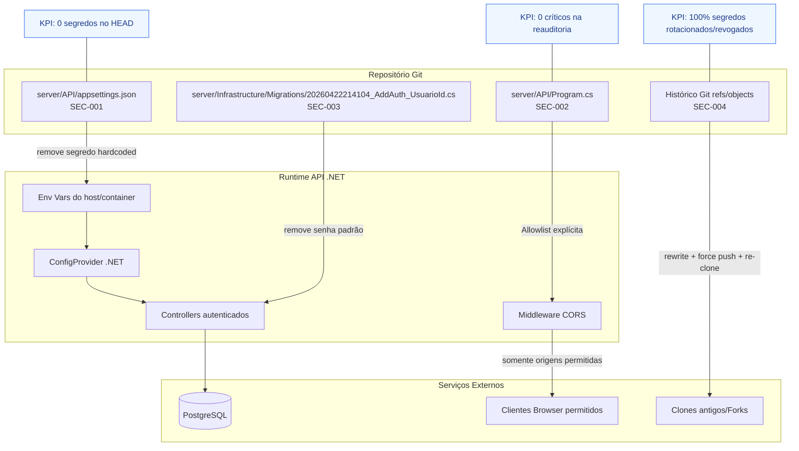

# Plano de Implementação — Eliminar Críticos de Segurança (Ciclo 1)

**Branch**: `001-eliminar-criticos-seguranca`
**Data**: 2026-05-20
**Spec**: `specs/001-eliminar-criticos-seguranca/spec.md`

## §0 Contexto de Negócio

- **Persona**: Rafael (único dev, PO e usuário).
- **Dor**: insegurança operacional por segredos expostos no HEAD e no histórico Git, com risco real de acesso indevido.
- **Valor entregue**: redução imediata de risco crítico direto, restauração de confiança para continuar evolução do produto com padrão profissional.
- **KPIs de sucesso do ciclo**:
  - Reauditoria com **0 achados críticos abertos**.
  - **100%** dos segredos comprometidos com evidência de rotação/revogação.
  - **0 segredos ativos** no HEAD.
- **Restrições comerciais/técnicas**:
  - Capacidade de execução: **5h/semana**.
  - Time de 1 pessoa (sem paralelismo humano).
  - Produção em servidor caseiro (alto impacto operacional em ações de rewrite de histórico).
  - Constitution v1.0.0 ativa e mandatória.

## §1 Arquitetura

**Impacto por SEC em KPI**

- **SEC-001** (`server/API/appsettings.json`): impacta diretamente KPI de 0 segredos no HEAD e reduz risco imediato de takeover.
- **SEC-002** (`server/API/Program.cs`): impacta KPI de 0 críticos ao remover misconfiguration crítica de superfície web.
- **SEC-003** (`server/Infrastructure/Migrations/...AddAuth_UsuarioId.cs`): impacta KPI de 0 segredos no HEAD e reduz risco de credencial previsível.
- **SEC-004** (histórico Git + clones): impacta KPI de 100% segredos rotacionados/revogados e sustentabilidade da remediação.

## §2 Componentes

| Arquivo/Sistema                                                        | Estado atual                                     | O que muda                                                                                                  | Responsabilidade                                    | SEC remediada   |
| ---------------------------------------------------------------------- | ------------------------------------------------ | ----------------------------------------------------------------------------------------------------------- | --------------------------------------------------- | --------------- |
| `server/API/appsettings.json`                                          | contém PostgresConnection/Jwt.Key/AdminKey reais | substituir por placeholders não sensíveis e leitura via env var; opcionalmente deixar fora de versionamento | impedir leak no HEAD e desacoplar segredo de código | SEC-001         |
| `server/API/appsettings.Example.json`                                  | já existe como exemplo                           | garantir exemplos sem segredo real e instruções de bootstrap                                                | onboarding seguro sem exposição                     | SEC-001         |
| `server/Infrastructure/Migrations/20260422214104_AddAuth_UsuarioId.cs` | seed com `__REDACTED_BOOTSTRAP_PASSWORD__` hardcoded              | remover seed sensível ou migrar para bootstrap de senha temporária de uso único                             | eliminar credencial padrão previsível               | SEC-003         |
| `server/API/Program.cs`                                                | CORS com `AllowAnyOrigin`                        | trocar para `WithOrigins(allowedOrigins)` com allowlist por ambiente                                        | reduzir superfície de chamada cross-origin          | SEC-002         |
| `docker-compose.yml` e env de runtime                                  | fallback inseguro pode persistir                 | exigir variáveis obrigatórias em ambiente local/prod                                                        | garantir injeção segura de segredo em runtime       | SEC-001/SEC-004 |
| Git history (`refs`, `objects`, tags)                                  | segredos expostos em commits antigos             | rewrite com ferramenta dedicada + force push controlado                                                     | reduzir exposição retroativa e impedir reutilização | SEC-004         |
| Servidor caseiro de produção                                           | risco de divergência após rewrite                | procedimento de re-clone e sincronização segura                                                             | continuidade operacional com risco controlado       | SEC-004         |

## §3 Fluxo de Dados (caminho feliz)

### 3.1 Segredo sai do código e passa a vir do ambiente

1. Operador define segredos no host/container (`POSTGRES_CONNECTION`, `JWT_KEY`, `ADMIN_KEY`) antes de subir a API.
2. Runtime .NET carrega `EnvironmentVariables` no startup do `Program`.
3. `Configuration` resolve os valores em tempo de execução; arquivos versionados mantêm apenas placeholders.
4. `TokenService`, conexão de banco e validação de `X-Admin-Key` consomem segredo somente da configuração em memória.
5. Logs operacionais não imprimem valor de segredo, apenas presença/ausência de configuração.

Ponto crítico de segurança: fronteira de startup (fail fast se variável obrigatória não estiver definida).

### 3.2 Validação de CORS em produção

1. Operador define `CORS_ALLOWED_ORIGINS` com lista explícita (separada por vírgula).
2. `Program` converte lista para array sanitizado e registra política CORS nomeada.
3. Middleware aplica `WithOrigins(origensPermitidas).AllowAnyHeader().AllowAnyMethod()`.
4. Browser envia requisição com header `Origin`.
5. Se origem não pertence à allowlist, resposta não inclui `Access-Control-Allow-Origin` e bloqueio ocorre no cliente.

Ponto crítico de latência/disponibilidade: parsing de allowlist no startup; erro de configuração deve falhar rápido e explícito.

## §4 Validação e Erros

Critério: cada SEC só muda para "resolvida" com comando reprodutível e evidência objetiva.

| SEC     | Verificação (comando)                                                                                       | Evidência esperada (pass/fail)                              |
| ------- | ----------------------------------------------------------------------------------------------------------- | ----------------------------------------------------------- | ------------------------------------------------------------------------------------------ | --------------------------------------------------------------------------------------- |
| SEC-001 | `git -C server ls-files                                                                                     | grep -E '^API/appsettings\.json$'`                          | **Passa**: saída vazia (arquivo real não versionado). **Falha**: qualquer linha retornada. |
| SEC-001 | `grep -nE 'PostgresConnection                                                                               | "Key"                                                       | AdminKey' server/API/appsettings.Example.json`                                             | **Passa**: apenas placeholders/exemplos não sensíveis (sem valores reais da auditoria). |
| SEC-002 | `grep -RIn 'AllowAnyOrigin' server/API/Program.cs`                                                          | **Passa**: saída vazia. **Falha**: ocorrência encontrada.   |
| SEC-002 | `grep -RIn 'WithOrigins' server/API/Program.cs`                                                             | **Passa**: pelo menos 1 ocorrência com allowlist explícita. |
| SEC-003 | `grep -RIn '__REDACTED_BOOTSTRAP_PASSWORD__' server/Infrastructure/Migrations`                                               | **Passa**: saída vazia.                                     |
| SEC-003 | `grep -RIn 'HashPassword\("' server/Infrastructure/Migrations`                                              | **Passa**: ausência de senha literal em migration seed.     |
| SEC-004 | `git log --all -S '__REDACTED_JWT_KEY__' -- server/API/appsettings.json`                        | **Passa**: saída vazia após rewrite e force push.           |
| SEC-004 | `git log --all -S '__REDACTED_ADMIN_KEY__' -- server/API/appsettings.json`                        | **Passa**: saída vazia após rewrite e force push.           |
| SEC-004 | `git log --all -S 'Password=__REDACTED_DB_PASSWORD__' -- server/API/appsettings.json`                                      | **Passa**: saída vazia após rewrite e force push.           |
| SEC-004 | `git log --all -S '__REDACTED_BOOTSTRAP_PASSWORD__' -- server/Infrastructure/Migrations/20260422214104_AddAuth_UsuarioId.cs` | **Passa**: saída vazia após rewrite e force push.           |

Erros esperados e tratamento:

- Se `CORS_ALLOWED_ORIGINS` vazio em produção: API deve falhar no startup com mensagem explícita de configuração inválida.
- Se segredo obrigatório ausente: API deve falhar no startup (fail fast), sem fallback inseguro.
- Se rewrite de histórico falhar: interromper publicação, restaurar mirror de backup e manter apenas rotação ativa até nova janela.

## §5 Estratégia de Execução em ONDAS CURTAS

### Onda 1 (~5h) — SEC-001 + SEC-003 (limpeza do HEAD)

- **Objetivo**: remover segredos ativos do HEAD e eliminar senha hardcoded na migration.
- **Dependências**: nenhuma.
- **Critério de saída**:
  - comandos SEC-001 e SEC-003 da §4 passando;
  - API sobe com segredos por env var;
  - nenhuma ocorrência de `__REDACTED_BOOTSTRAP_PASSWORD__` no HEAD.
- **Esforço estimado**: 5h (M).

### Onda 2 (~5h) — SEC-002 (CORS allowlist)

- **Objetivo**: substituir política global permissiva por allowlist explícita de origens.
- **Dependências**: Onda 1 concluída (evita múltiplas causas de falha em validação de segurança).
- **Critério de saída**:
  - `AllowAnyOrigin` inexistente;
  - `WithOrigins` ativo e configurado por ambiente;
  - teste manual de origem não permitida bloqueada no browser.
- **Esforço estimado**: 4-5h (S/M).

### Onda 3 (~5h) — SEC-004 (rotação + limpeza de histórico)

- **Objetivo**: rotacionar/revogar todos os segredos comprometidos e limpar histórico Git com segurança operacional.
- **Dependências**: Onda 1 e Onda 2 concluídas.
- **Critério de saída**:
  - evidência de rotação/revogação de 100% dos segredos comprometidos;
  - comandos de varredura histórica da §4 sem resultados;
  - servidor caseiro sincronizado via re-clone validado.
- **Esforço estimado**: 5h (L operacional, M técnico).

### Justificativa da ordem

1. **SEC-001 antes de SEC-004**: primeiro remove risco ativo no HEAD e bloqueia novos vazamentos; limpar histórico sem limpar HEAD mantém exposição viva em novos commits.
2. **SEC-003 junto com SEC-001**: ambos tratam credenciais hardcoded no estado atual e têm baixo acoplamento com rewrite histórico.
3. **SEC-002 antes de SEC-004**: reduz superfície de exploração no runtime antes da janela operacional arriscada de force push/re-clone.
4. **SEC-004 por último**: é a etapa de maior risco operacional e depende do ambiente já estar seguro no estado corrente.

## §6 Constitution Check

| Princípio                               | Regra-chave aplicada neste plano                                                                                     | Resultado binário             | Observação/Exceção                                                                                                           |
| --------------------------------------- | -------------------------------------------------------------------------------------------------------------------- | ----------------------------- | ---------------------------------------------------------------------------------------------------------------------------- |
| I. Bounded Architecture                 | mudanças concentradas em configuração/API/infra, sem introduzir dependência de framework no Core                     | **Conforme**                  | sem exceção                                                                                                                  |
| II. Security by Default                 | segredos fora do código, rotação obrigatória, CORS allowlist explícita                                               | **Conforme**                  | sem exceção                                                                                                                  |
| III. Quality Gates Executáveis          | validações de segurança reprodutíveis por comando; build/lint/test completos ainda limitados por capacidade          | **Não conforme (temporário)** | exceção até **2026-06-30** para cobertura mínima formal; mitigação: evidências mandatórias da §4 + reauditoria de fechamento |
| IV. Data Integrity                      | escopo não altera regras monetárias/transações; risco de regressão minimizado por mudança apenas em segurança/config | **Conforme**                  | sem exceção                                                                                                                  |
| V. Operability e Observabilidade Segura | fail fast de configuração e plano de rollback por onda para continuidade do servidor caseiro                         | **Conforme**                  | sem exceção                                                                                                                  |

## §7 Trade-offs e Riscos

| Risco                                                    | Impacto                                       | Mitigação concreta                                                                    | Plano de reversão                                                                        |
| -------------------------------------------------------- | --------------------------------------------- | ------------------------------------------------------------------------------------- | ---------------------------------------------------------------------------------------- |
| Rewrite de histórico exige force push e invalida clones  | perda de produtividade e confusão de branches | comunicar janela, congelar merge, checklist de re-clone obrigatório                   | restaurar mirror de backup e refazer janela com script validado                          |
| Servidor caseiro pode ficar desalinhado após rewrite     | downtime e falha de deploy                    | executar runbook de re-clone + validação de saúde `/health` e `/ready`                | voltar para snapshot anterior do workspace no servidor e reexecutar sincronização guiada |
| Rotação de segredo pode quebrar autenticação/DB          | indisponibilidade da API                      | rotação com ordem controlada (gerar novo, aplicar, validar, revogar antigo)           | reativar credencial anterior por janela curta e repetir rotação com checklist            |
| CORS allowlist pode bloquear frontend legítimo           | indisponibilidade funcional no browser        | incluir origem de produção e local explicitamente, testar preflight antes de publicar | fallback temporário para lista mínima validada em arquivo de env anterior                |
| Remoção de seed hardcoded pode impedir bootstrap         | bloqueio de acesso inicial admin              | criar fluxo manual de bootstrap seguro com senha temporária de uso único              | executar procedimento de criação manual de admin com expiração forçada                   |
| Capacidade de 5h/semana pode atrasar fechamento do ciclo | risco de ciclo aberto por várias semanas      | ondas pequenas com critérios de saída binários e sem escopo extra                     | pausar itens não críticos, manter foco exclusivo SEC-001..004                            |

### Estratégia de rollback por onda

- **Rollback Onda 1**: restaurar alterações locais em config/migration via branch de contingência, mantendo segredos novos já rotacionados; reabrir onda com patch menor.
- **Rollback Onda 2**: reverter apenas política CORS para última allowlist funcional conhecida (não voltar para `AllowAnyOrigin`).
- **Rollback Onda 3**: caso force push quebre operação, restaurar mirror pré-rewrite, manter segredos já rotacionados e reagendar rewrite com validação prévia em clone espelho.

## §8 Decisões Arquiteturais (ADR-like)

### ADR-1 — Gestão de secrets daqui pra frente

- **Decisão**: adotar variáveis de ambiente como padrão único no ciclo 1, com suporte local via `.env` não versionado e placeholders apenas em arquivos de exemplo.
- **Alternativas consideradas**:
  - User Secrets (.NET): boa para dev local, fraca para produção padronizada.
  - `.env` versionado: simples, mas alto risco de novo vazamento.
  - Azure Key Vault: segurança forte, mas overhead alto para capacidade atual (5h/semana) e servidor caseiro.
- **Justificativa (técnica + negócio)**:
  - menor esforço para reduzir risco crítico agora;
  - compatível com operação atual (docker/host local) sem custo adicional imediato;
  - permite evoluir para secret manager gerenciado no próximo ciclo.
- **Consequências**:
  - exige disciplina operacional de configuração no host;
  - aumenta necessidade de checklist de startup;
  - dívida técnica registrada para possível migração a vault dedicado.

### ADR-2 — Ferramenta para limpeza de histórico (BFG vs git-filter-repo)

- **Decisão**: usar `git-filter-repo` como ferramenta principal; manter BFG como fallback.
- **Alternativas consideradas**:
  - BFG Repo-Cleaner: rápido e simples para casos básicos.
  - `git-filter-repo`: mais flexível, melhor controle por path e replace text.
- **Justificativa (técnica + negócio)**:
  - `git-filter-repo` oferece controle fino para múltiplos segredos e menor risco de limpeza incompleta;
  - para ambiente com servidor caseiro e operador único, reduzir retrabalho é crítico.
- **Consequências**:
  - curva de uso ligeiramente maior;
  - precisa de dry-run em clone espelho antes do force push final.

### ADR-3 — Rotação manual vs automatizada

- **Decisão**: rotação manual guiada por checklist no ciclo 1; automação entra como item de ciclo posterior.
- **Alternativas consideradas**:
  - automação imediata (scripts/pipeline): mais robusta, porém fora da capacidade de 5h/semana neste ciclo.
  - rotação manual ad-hoc sem checklist: rápida, porém insegura e não auditável.
- **Justificativa (técnica + negócio)**:
  - objetivo principal é eliminar críticos com evidência objetiva no menor tempo;
  - checklist manual oferece rastreabilidade suficiente para auditoria de fechamento sem estourar esforço.
- **Consequências**:
  - maior dependência de execução disciplinada;
  - risco humano mitigado por comandos de validação da §4 e revisão pós-onda.
