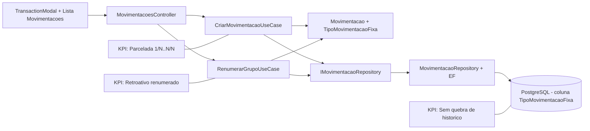

# Plano de Implementacao — Parcelamento Inteligente com Numeracao Automatica (Ciclo 3)

**Branch**: `003-parcelamento-inteligente-ciclo-3`
**Data**: 2026-05-25
**Spec**: `specs/003-parcelamento-inteligente-ciclo-3/spec.md`

## §0 Contexto de Negócio

- **Persona**: Rafael (uso diario no desktop).
- **Dor**: parcelamento gerado sem numeracao no titulo exige manutencao manual, com alto atrito.
- **Valor entregue**: parcelado numerado automaticamente + recorrente fixa preservada + renumeracao retroativa sob demanda.
- **KPIs**:
  - parcelas novas com numeracao automatica correta.
  - recorrentes fixas sem numeracao indevida.
  - grupos legados renumerados de forma deterministica quando solicitado.
  - sem regressao de build/testes.
- **Restricoes**:
  - sem breaking change de contrato para clientes existentes.
  - migration com default seguro para historico.
  - sem escopo de recorrencia infinita neste ciclo.

## §1 Arquitetura

**Anotacao de fronteiras**

- Dominio define semantica (`TipoMovimentacaoFixa`) e regra de numeracao.
- Infrastructure persiste novo campo e consulta grupo para renumerar.
- API expoe endpoint de renumeracao autenticado.
- Frontend envia/consome tipo fixo e aciona renumeracao.

## §2 Componentes

| Componente                                                                  | Estado atual                                                     | O que muda                                             | Responsabilidade                             | Impacto de negócio           |
| --------------------------------------------------------------------------- | ---------------------------------------------------------------- | ------------------------------------------------------ | -------------------------------------------- | ---------------------------- |
| `server/Core/Domain/Movimentacao/*`                                         | `Fixa + Periodo + TipoRecorrencia` sem tipo semantico de fixacao | novo enum e propriedade `TipoMovimentacaoFixa`         | semantica correta de parcelado vs recorrente | reduz ambiguidade            |
| `server/Core/Application/DTOs/Movimentacao/MovimentacaoDTO.cs`              | sem campo de tipo fixo                                           | incluir `TipoMovimentacaoFixa` com default compativel  | transportar intencao do usuario              | evita inferencia incorreta   |
| `server/Core/UseCases/Movimentacao/CriarMovimentacaoUseCase.cs`             | clona titulo sem alteracao                                       | gerar sufixo `{i+1}/{N}` para parcelada                | automacao no cadastro                        | elimina trabalho manual      |
| `server/Core/UseCases/Movimentacao/RenumerarGrupoUseCase.cs`                | inexistente                                                      | novo caso de uso retroativo                            | normalizar e renumerar grupo existente       | corrige historico legado     |
| `server/Core/Repositories/IMovimentacaoRepository.cs`                       | sem operacoes por grupo para renumerar                           | incluir metodos de busca/atualizacao em lote por grupo | suporte a renumeracao                        | base para endpoint           |
| `server/Infrastructure/Repositories/Movimentacao/MovimentacaoRepository.cs` | CRUD atual sem renumeracao                                       | implementar consultas por grupo e persistencia em lote | execucao eficiente no banco                  | confiabilidade da operacao   |
| `server/API/Controllers/Movimentacao/MovimentacoesController.cs`            | sem endpoint de renumeracao                                      | novo endpoint autenticado para renumerar grupo         | exposicao de operacao retroativa             | acao direta via UI           |
| `server/Infrastructure/Migrations/*`                                        | sem coluna de tipo fixo                                          | migration com coluna e default `RecorrenteFixa`        | compatibilidade de dados                     | sem quebra em producao       |
| `client/src/components/TransactionModal.jsx`                                | toggle apenas de recorrencia/cadencia                            | toggle `Parcelada/Recorrente Fixa` quando `Fixa=true`  | captura intencao no cadastro                 | previsibilidade no resultado |
| `client/src/components/DashboardView.jsx` (ou listagem equivalente)         | sem acao de renumerar grupo                                      | CTA de renumerar grupo recorrente existente            | manutencao retroativa por UI                 | produtividade do usuario     |

## §3 Fluxo de Dados (caminho feliz)

1. Usuario marca `Fixa=true` no modal e escolhe `TipoMovimentacaoFixa`.
2. Frontend envia payload com novo campo para `POST /api/v1/movimentacoes`.
3. Controller constroi entidade com `TipoMovimentacaoFixa`.
4. `CriarMovimentacaoUseCase`:
   - para `Parcelada`: clona N ocorrencias com sufixo `{i+1}/{N}` no titulo.
   - para `RecorrenteFixa`: mantem titulo base sem sufixo.
5. Dados persistem com novo campo no banco (migration aplicada).
6. Para legado, usuario aciona renumerar grupo na UI.
7. Endpoint de renumeracao chama `RenumerarGrupoUseCase(grupoRecorrenciaId)`.
8. Use case busca ocorrencias do grupo por ordem cronologica, normaliza titulo base e reaplica `1/N..N/N`.

**Pontos criticos**

- Normalizacao de sufixo legado deve ser deterministica e idempotente.
- Ordenacao da renumeracao precisa ter desempate estavel (data + id).
- Endpoint deve operar no escopo do usuario autenticado.

## §4 Validação e Erros

| Regra                      | Verificação                                                | Resultado esperado                                      |
| -------------------------- | ---------------------------------------------------------- | ------------------------------------------------------- |
| Parcelada numerada         | criar movimentacao parcelada com periodo N                 | N titulos com sufixo `1/N..N/N`                         |
| Recorrente fixa preservada | criar recorrente fixa com periodo N                        | sem sufixo numerico automatico                          |
| Migration segura           | aplicar migration em base existente                        | coluna nova preenchida com default `RecorrenteFixa`     |
| Renumeracao retroativa     | executar endpoint por grupo                                | titulos normalizados/renumerados sem perda de registros |
| Qualidade                  | `dotnet test`, `npm run lint`, `npm run build`, `npm test` | todos verdes                                            |

**Erros esperados**

- grupo inexistente -> `404` ou erro de dominio equivalente.
- grupo sem permissao do usuario -> `404/403` conforme politica atual.
- periodo invalido em parcelada -> `400` com mensagem de validacao.

## §5 Integrações Externas (se houver)

- Sem nova integracao externa.
- Persistencia continua em PostgreSQL via EF Core.

## §6 Constitution Check

| Princípio                      | Resultado                       | Justificativa                                                                    |
| ------------------------------ | ------------------------------- | -------------------------------------------------------------------------------- |
| I. Bounded Architecture        | **Conforme**                    | regra no Core, persistencia na Infrastructure, orquestracao na API, UI no client |
| II. Security by Default        | **Conforme**                    | endpoint de renumeracao sob auth existente, sem exposicao de segredos            |
| III. Quality Gates Executáveis | **Conforme com meta explicita** | plano exige testes/gates ao final de cada bloco                                  |
| IV. Data Integrity             | **Conforme**                    | migration com default seguro e renumeracao deterministica por grupo              |
| V. Operability/Observability   | **Conforme**                    | erros de renumeracao tratados na fronteira e rastreaveis                         |

## §7 Trade-offs e Riscos

| Risco                                                | Impacto                            | Mitigação concreta                                    |
| ---------------------------------------------------- | ---------------------------------- | ----------------------------------------------------- |
| Regex de normalizacao remover parte valida do titulo | perda semantica no titulo          | aplicar regex apenas no sufixo terminal `\s+\d+/\d+$` |
| Renumeracao em grupo grande gerar latencia           | UX degradada no comando retroativo | limitar escopo por grupo e atualizar em lote          |
| Inconsistencia de ordenacao em datas iguais          | numeracao instavel                 | ordenar por `Data` e desempatar por `Id`              |
| Migration em producao com default incorreto          | classificacao errada de historico  | script de migration revisado e validacao pre-deploy   |
| UI confusa entre Parcelada e Recorrente Fixa         | erro de cadastro                   | microcopy explicita no modal e valor default seguro   |

## §8 Decisões Arquiteturais (ADR-like)

### ADR-1 — Novo enum semantico em vez de inferencia por periodo

- **Decisão**: introduzir `TipoMovimentacaoFixa` explicito no dominio.
- **Alternativas consideradas**: inferir tipo por `Periodo`.
- **Justificativa**: intencao do usuario nao e derivada confiavel de `Periodo`.
- **Consequências**: exige migration e ajuste de DTO/UI.

### ADR-2 — Default `RecorrenteFixa` no legado

- **Decisão**: dados existentes recebem `RecorrenteFixa` por default.
- **Alternativas consideradas**: tentativa de inferencia automatica retroativa.
- **Justificativa**: evita classificacao incorreta silenciosa em historico.
- **Consequências**: renumeracao retroativa vira acao explicita do usuario.

### ADR-3 — Renumeracao sob comando explicito

- **Decisão**: criar `RenumerarGrupoUseCase` acionado por endpoint/UI.
- **Alternativas consideradas**: renumerar tudo automaticamente na migration.
- **Justificativa**: reduce risco de alterar titulos historicos sem confirmacao.
- **Consequências**: adiciona endpoint e CTA de manutencao no frontend.
