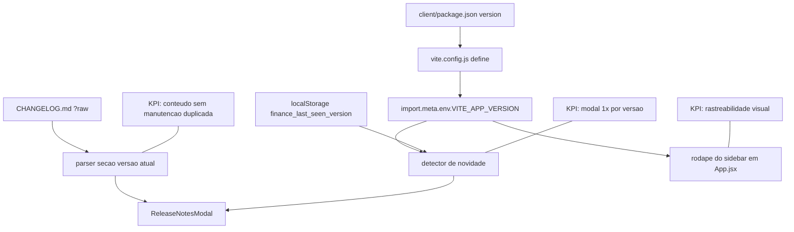

# Plano de Implementacao — Versionamento e Release Notes Automaticas (Ciclo 4)

**Branch**: `004-release-notes-versioning-ciclo-4`
**Data**: 2026-05-26
**Spec**: `specs/004-release-notes-versioning-ciclo-4/spec.md`

## §0 Contexto de Negócio

- **Persona**: Rafael, usuario diario do Finance.
- **Dor**: ausencia de visibilidade de deploy e mudancas apos atualizacao.
- **Valor**: onboarding instantaneo de novidades via modal + rastreabilidade por versao no sidebar.
- **KPIs**:
  - modal aparece apenas em nova versao.
  - versao sempre visivel no app autenticado.
  - nenhuma regressao em lint/build/test.
- **Restricoes**:
  - 100% frontend.
  - sem libs novas.
  - chave de persistencia fixa `finance_last_seen_version`.

## §1 Arquitetura

**Impacto por componente**

- `vite.config.js`: garante propagacao da versao em build-time.
- parser local: seleciona apenas secao da versao atual do changelog.
- `ReleaseNotesModal.jsx`: camada de apresentacao/controlador de exibicao unica.
- `App.jsx`: orquestra abertura e exibe versao no sidebar autenticado.

## §2 Componentes

| Arquivo                                                 | Estado atual                     | O que muda                                                   | Responsabilidade                 | Impacto de negócio                       |
| ------------------------------------------------------- | -------------------------------- | ------------------------------------------------------------ | -------------------------------- | ---------------------------------------- |
| `CHANGELOG.md`                                          | headers por ciclo textual        | converter para headers semver `## [0.X.0]` mantendo conteudo | fonte de release notes           | elimina duplicidade e melhora governanca |
| `client/package.json`                                   | versao `0.0.0`                   | normalizar para `0.3.0` e bump para `0.4.0`                  | verdade unica de versao do app   | rastreabilidade de release               |
| `client/vite.config.js`                                 | sem define de versao             | injetar `VITE_APP_VERSION` via `define`                      | disponibilizar versao em runtime | suporte ao detector e rodape             |
| `client/src/components/ReleaseNotesModal.jsx`           | inexistente                      | novo modal com conteudo parseado e acao de confirmar         | UX de comunicacao de mudancas    | feedback imediato ao usuario             |
| `client/src/util/releaseNotes.js` (ou util equivalente) | inexistente                      | parse da secao semver atual em markdown bruto                | regra de extracao testavel       | reduz risco de parser incorreto          |
| `client/src/App.jsx`                                    | sem release notes/version footer | detectar versao nova, abrir modal e exibir versao no sidebar | orquestracao do fluxo            | visibilidade operacional                 |
| `client/src/**/*.test.*`                                | sem cobertura para release notes | adicionar testes de parser e deteccao                        | quality gate do ciclo            | evita regressao silenciosa               |

## §3 Fluxo de Dados (caminho feliz)

1. Build carrega versao do `client/package.json` em `VITE_APP_VERSION` via Vite define.
2. App importa `CHANGELOG.md?raw` no bundle.
3. App calcula `currentVersion = import.meta.env.VITE_APP_VERSION`.
4. App le `lastSeen = localStorage.getItem('finance_last_seen_version')`.
5. Se `lastSeen !== currentVersion`, parser extrai secao `## [currentVersion]` do changelog.
6. Havendo secao valida, `ReleaseNotesModal` e exibido ao usuario autenticado.
7. Ao confirmar/fechar, app grava `finance_last_seen_version = currentVersion`.
8. Sidebar mostra `v{currentVersion}` no rodape independentemente do modal.

**Pontos criticos**

- Parser deve parar na proxima linha `## [` para nao vazar versoes anteriores.
- Leitura/escrita de localStorage deve ser envolvida por try/catch defensivo.
- Se secao nao existir, app deve seguir silenciosamente sem modal.

## §4 Validação e Erros

| Regra                     | Verificação                  | Erro esperado             | Justificativa de negócio       |
| ------------------------- | ---------------------------- | ------------------------- | ------------------------------ |
| Detectar nova versao      | `lastSeen != currentVersion` | n/a                       | comunicar mudancas apos deploy |
| Evitar repeticao          | `lastSeen == currentVersion` | n/a                       | evitar fadiga de modal         |
| Changelog sem secao       | parser retorna vazio/null    | modal nao abre, app segue | resiliencia operacional        |
| localStorage indisponivel | excecao no acesso            | fallback sem crash        | manter acesso ao app           |
| Sidebar versionado        | rodape exibe `vX.Y.Z`        | n/a                       | observabilidade para suporte   |

## §5 Integrações Externas (se houver)

- Nao ha integracoes externas novas.
- Uso exclusivo de recursos de build Vite e APIs nativas do browser.

## §6 Constitution Check

| Princípio                               | Resultado                | Evidência/justificativa                                                          |
| --------------------------------------- | ------------------------ | -------------------------------------------------------------------------------- |
| I. Bounded Architecture                 | **Conforme**             | alteracoes em `client/` e documento raiz `CHANGELOG.md`; sem impacto em Core/API |
| II. Security by Default                 | **Conforme**             | localStorage guarda apenas versao sem dados sensiveis                            |
| III. Quality Gates Executáveis          | **Conforme**             | tasks incluem lint/build/test frontend e correcao obrigatoria                    |
| IV. Data Integrity                      | **Nao aplicavel direto** | sem persistencia financeira ou migration backend                                 |
| V. Operability e Observabilidade Segura | **Conforme**             | versao no sidebar melhora diagnostico de ambiente                                |

## §7 Trade-offs e Riscos

| Risco                                                 | Impacto                    | Mitigação                                                  |
| ----------------------------------------------------- | -------------------------- | ---------------------------------------------------------- |
| Divergencia package version (0.0.0 vs 0.3.0 esperado) | confusao de historico      | normalizar baseline e registrar no changelog/spec          |
| Parser simples falhar com formato inesperado          | modal sem conteudo         | contrato de formato `## [x.y.z]` + testes unitarios        |
| Import raw aumentar bundle marginalmente              | impacto pequeno de tamanho | manter changelog conciso e sem anexos grandes              |
| localStorage limpo manualmente                        | modal reexibido            | comportamento aceito e documentado                         |
| Exibir modal em contexto nao autenticado              | UX inconsistente           | renderizar fluxo dentro da arvore autenticada de `App.jsx` |

## §8 Decisões Arquiteturais (ADR-like)

### ADR-1 — CHANGELOG.md como unica fonte de verdade

- **Decisão**: consumir `CHANGELOG.md` via raw import.
- **Alternativas**: arquivo JSON dedicado, endpoint backend.
- **Justificativa**: reduz manutencao duplicada e custo de operacao.
- **Consequências**: exige parser local e disciplina de formato semver.

### ADR-2 — Deteccao por `localStorage` version key

- **Decisão**: comparar `VITE_APP_VERSION` com `finance_last_seen_version`.
- **Alternativas**: cookie, backend profile flag.
- **Justificativa**: solucao simples, local e sem backend.
- **Consequências**: reset de storage reexibe modal (aceito).

### ADR-3 — Version footer no sidebar autenticado

- **Decisão**: mostrar versao em `App.jsx` no rodape da barra lateral.
- **Alternativas**: mostrar apenas no modal.
- **Justificativa**: ganho continuo de observabilidade sem depender de evento.
- **Consequências**: ajuste pequeno de layout e responsividade.
