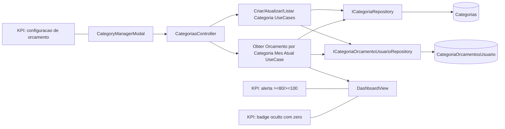

# Plano de Implementacao — Orcamento por Categoria com Alertas Visuais

**Branch**: `007-orcamento-por-categoria`
**Data**: 2026-05-26
**Spec**: `specs/007-orcamento-por-categoria/spec.md`

## §0 Contexto de Negócio

- **Persona**: Rafael, usuario diario do Finance.
- **Dor**: falta de teto por categoria gera controle apenas reativo do gasto.
- **Valor**: orcamento mensal por categoria + alerta visual antecipado no dashboard.
- **KPIs**:
  - configuracao de orcamento via modal de categorias.
  - alerta por faixa (>=80% e >=100%) no mes atual.
  - badge de alerta visivel no dashboard e oculto quando zero alertas.
- **Restricoes**:
  - sem nova tela/rota de UI.
  - integrado em `CategoryManagerModal.jsx` e `DashboardView.jsx`.
  - migration obrigatoria para coluna de orcamento em `Categorias`.
  - categorias globais aceitam override de orcamento por usuario, sem alterar a categoria global.

## §1 Arquitetura

**Anotacoes de desenho**

- Orcamento de categoria do usuario sera lido por projeção: `orcamentoEfetivo = categoria.orcamentoMensal (categoria do usuario) OU override em CategoriaOrcamentosUsuario (quando categoria global)`.
- Para categoria global, alteracoes de `Nome/Icone/Cor` continuam protegidas; apenas override de orcamento por usuario e gravado em tabela separada.
- Dashboard consome dados agregados do backend para evitar logica pesada e duplicada no client.

## §2 Componentes

| Arquivo                                                                    | Estado atual                                     | O que muda                                                                | Responsabilidade                                   | Impacto de negocio          |
| -------------------------------------------------------------------------- | ------------------------------------------------ | ------------------------------------------------------------------------- | -------------------------------------------------- | --------------------------- |
| `server/Core/Domain/Categoria.cs`                                          | sem campo de orcamento                           | adicionar `OrcamentoMensal` opcional + validacao monetaria                | regra de dominio para categoria do usuario         | habilita controle por teto  |
| `server/Core/Application/DTOs/Categoria/CategoriaDTO.cs`                   | sem orcamento                                    | incluir campo opcional de orcamento                                       | transporte do dado na API                          | persistencia sem nova tela  |
| `server/Core/Domain/CategoriaOrcamentoUsuario.cs`                          | inexistente                                      | nova entidade de override por usuario                                     | separar override de global sem alterar base global | atende CL-001               |
| `server/Core/Repositories/ICategoriaRepository.cs`                         | CRUD basico                                      | incluir metodos para leitura com orcamento efetivo                        | composicao de categoria + override                 | viabiliza modal e dashboard |
| `server/Core/Repositories/ICategoriaOrcamentoUsuarioRepository.cs`         | inexistente                                      | contrato de upsert/busca de override                                      | persistencia do override por usuario               | isolamento de dados         |
| `server/Core/UseCases/Categoria/*`                                         | CRUD sem orcamento                               | adaptar criar/atualizar/listar para orcamento e regra de global override  | regra de aplicacao                                 | comportamento consistente   |
| `server/Core/UseCases/Categoria/ObterAlertasOrcamentoCategoriasUseCase.cs` | inexistente                                      | novo caso de uso de consumo do mes atual por categoria                    | calcular estado de alerta e badge                  | valor direto no dashboard   |
| `server/API/Controllers/CategoriasController.cs`                           | endpoints CRUD                                   | aceitar/retornar orcamento e expor endpoint de alertas do mes atual       | fronteira HTTP                                     | integra modal + dashboard   |
| `server/Infrastructure/Data/FinanceDbContext.cs`                           | categoria sem orcamento e sem tabela de override | mapear campo `OrcamentoMensal` e entidade de override                     | modelo EF Core                                     | persistencia segura         |
| `server/Infrastructure/Migrations/*`                                       | sem suporte a orcamento                          | migration adiciona `OrcamentoMensal` em `Categorias` + tabela de override | evolucao de schema                                 | deploy sem quebra           |
| `server/Infrastructure/Repositories/CategoriaRepository.cs`                | leitura simples                                  | leitura com orcamento efetivo e suporte a global override                 | acesso a dados                                     | consistencia de listagem    |
| `client/src/components/CategoryManagerModal.jsx`                           | CRUD de nome/icone/cor                           | campo de orcamento opcional e UX de limpar valor                          | gerenciamento pelo fluxo existente                 | adocao sem friccao          |
| `client/src/components/DashboardView.jsx`                                  | comparativo e categorias sem teto                | barra de progresso com cor por faixa e badge agregado                     | visibilidade de alerta                             | decisao rapida de gasto     |

## §3 Fluxo de Dados (caminho feliz)

1. Usuario abre `CategoryManagerModal` e informa orcamento mensal para uma categoria.
2. Frontend envia `CategoriaDTO` com `OrcamentoMensal`.
3. `CategoriasController` delega para use case de criar/atualizar.
4. Regras de persistencia:
   - categoria do usuario: grava em `Categorias.OrcamentoMensal`.
   - categoria global: grava/atualiza override em `CategoriaOrcamentosUsuario` (usuario + categoria global).
5. `ListarCategoriasUseCase` retorna categorias com `OrcamentoMensalEfetivo` para o usuario atual.
6. Dashboard solicita endpoint de alertas mensais por categoria.
7. `ObterAlertasOrcamentoCategoriasUseCase` agrega despesas do mes atual por categoria e calcula:
   - `PercentualConsumo`
   - `EstadoAlerta` (`Normal`, `Atencao`, `Estourado`)
   - `TotalCategoriasEmAlerta`
8. Dashboard renderiza barras e badge; badge fica oculto quando `TotalCategoriasEmAlerta == 0`.

**Pontos criticos**

- Cálculo de consumo considera apenas despesas (saidas) e nunca receitas.
- Divisao por zero deve ser evitada quando orcamento ausente ou invalido.
- Override global deve respeitar isolamento por usuario e nao alterar categoria global base.

## §4 Validação e Erros

| Regra                       | Verificacao                              | Codigo/Status esperado          | Ordem | Justificativa de negocio          |
| --------------------------- | ---------------------------------------- | ------------------------------- | ----- | --------------------------------- |
| Orcamento opcional          | categoria sem valor de orcamento         | `200/201`                       | 1     | nao quebrar categorias existentes |
| Orcamento invalido          | valor `<= 0`                             | `400`                           | 2     | impedir alertas sem sentido       |
| Override global por usuario | atualizar global com orcamento           | `200/204` com override separado | 3     | respeitar CL-001                  |
| Alerta >=80%                | consumo/orcamento >= 0.8 e < 1           | `estado=Atencao`                | 4     | antecipacao de risco              |
| Alerta >=100%               | consumo/orcamento >= 1                   | `estado=Estourado`              | 5     | sinalizar excesso                 |
| Badge zero                  | nenhuma categoria em alerta              | badge oculto                    | 6     | respeitar CL-002                  |
| Sem autenticacao            | acesso aos endpoints de categoria/alerta | `401`                           | 7     | seguranca por sessao              |

## §5 Integrações Externas (se houver)

- Sem novas integracoes externas.
- Persistencia local em PostgreSQL via EF Core.
- Visualizacao usa componentes existentes de Tailwind e Recharts ja instalados.

## §6 Constitution Check

| Princípio                               | Resultado    | Justificativa                                                                           |
| --------------------------------------- | ------------ | --------------------------------------------------------------------------------------- |
| I. Bounded Architecture                 | **Conforme** | dominio/use case no Core, persistencia no Infrastructure, HTTP no API, render no client |
| II. Security by Default                 | **Conforme** | isolamento por usuario para override e calculo de alerta                                |
| III. Quality Gates Executáveis          | **Conforme** | tasks exigem build/test/lint em backend e frontend                                      |
| IV. Data Integrity                      | **Conforme** | orcamento em decimal/numeric + migration com rollback                                   |
| V. Operability e Observabilidade Segura | **Conforme** | erros de validacao com respostas acionaveis sem PII                                     |

## §7 Trade-offs e Riscos

| Risco                                         | Impacto                  | Mitigação concreta                                                |
| --------------------------------------------- | ------------------------ | ----------------------------------------------------------------- |
| Sobrescrita indevida de categoria global      | afetar todos os usuarios | separar override em tabela por usuario (sem update em row global) |
| Alertas excessivos por orcamentos irreais     | fadiga visual            | comportamento documentado, badge oculto quando zero               |
| Divergencia entre orcamento modal e dashboard | UX inconsistente         | endpoint unico de alertas com calculo server-side                 |
| Query pesada no dashboard                     | latencia                 | agregar por mes e categoria no banco com recorte mensal           |
| Migration sem rollback seguro                 | risco operacional        | gerar migration reversivel e validar em homolog/local             |

## §8 Decisões Arquiteturais (ADR-like)

### ADR-1 — Override por usuario para categoria global

- **Decisão**: criar persistencia separada (`CategoriaOrcamentosUsuario`) para orcamento de categoria global.
- **Alternativas consideradas**: adicionar `OrcamentoMensal` direto em `Categorias` globais.
- **Justificativa (tecnica + negocio)**: evita efeito colateral global entre usuarios e atende requisito de personalizacao individual.
- **Consequências**: aumenta complexidade de leitura/escrita, mas preserva isolamento e integridade de produto.

### ADR-2 — Badge oculto quando zero alertas

- **Decisão**: nao renderizar badge quando contagem de alerta for zero.
- **Alternativas consideradas**: mostrar badge com `0`.
- **Justificativa (tecnica + negocio)**: reduz ruido visual e reforca destaque apenas quando existe acao necessaria.
- **Consequências**: exige logica condicional simples no dashboard.

### ADR-3 — Calculo de alerta no backend

- **Decisão**: consolidar calculo de consumo e estado no backend.
- **Alternativas consideradas**: calcular tudo no frontend com dados brutos.
- **Justificativa (tecnica + negocio)**: consistencia de regra entre telas/cliente e menor custo de manutencao futura.
- **Consequências**: adiciona endpoint e use case especifico para dashboard.
