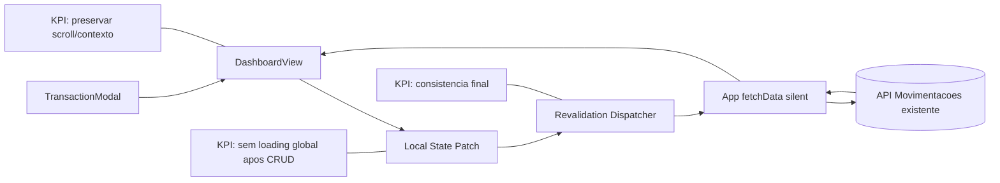

# Plano de Implementacao — Eliminar Refresh Global do Dashboard apos CRUD de Movimentacoes

## Changelog (2026-05-27)

- Definido ownership explicito do estado canonico durante a transicao.
- Adicionadas regras de sincronizacao por periodo ativo (`mes/ano`) com descarte de resposta obsoleta.
- Formalizada politica deterministica de rollback por tipo de falha.
- Incluida cobertura explicita de `apply simulation` em lote na validacao.

**Branch**: `008-eliminar-refresh-global-dashboard`
**Data**: 2026-05-27
**Spec**: `specs/008-eliminar-refresh-global-dashboard/spec.md`

## §0 Contexto de Negócio

- **Persona**: PO/usuario unico com uso recorrente do dashboard.
- **Dor**: refresh global apos mutacao quebra continuidade visual e gera perda de contexto.
- **Valor**: manter interacao fluida com update local + reconciliacao silenciosa.
- **KPIs**:
  - fallback global ausente apos CRUD.
  - scroll/contexto preservados.
  - percepcao de recarregamento reduzida.
- **Restricoes**:
  - sem alterar contratos backend/API.
  - sem redesign amplo.
  - foco em baixo risco nas abas do dashboard.

## §1 Arquitetura

**Princípios de desenho**

- Escrita imediata no estado local para resposta de UX.
- Revalidacao assincrona sem acionar bloqueio global.
- Guarda contra race condition via token monotônico local.

## §1.1 Ownership do Estado Canonico

- **Decisao**: `App.jsx` e o dono do estado canonico global de dados de movimentacao (por periodo ativo).
- **Papel do Dashboard**: `DashboardView.jsx` mantem apenas estado de apresentacao e patch local transitorio para UX imediata.
- **Regra de sincronizacao**:
  1. Dashboard aplica patch local no periodo ativo.
  2. Dashboard solicita revalidacao silenciosa ao App com `periodKey`.
  3. App atualiza estado canonico somente se resposta corresponder ao `periodKey` ainda ativo e ao token mais recente.
  4. Se periodo mudou, resposta antiga e descartada (ou no-op), evitando drift estrutural.

## §2 Componentes

| Arquivo | Estado atual | O que muda | Responsabilidade | Impacto de negócio |
| --- | --- | --- | --- | --- |
| `client/src/App.jsx` | `fetchData` sempre aciona `loading` global | separar `initialLoading` de `isRevalidating`; adicionar modo silencioso no fetch | orquestracao de estado global da pagina | elimina piscada da tela inteira |
| `client/src/components/DashboardView.jsx` | mutacoes chamam `fetchData()` e disparam fallback global | aplicar patch local para create/edit/delete e disparar revalidacao silenciosa | UX transacional local + reconciliacao | preserva scroll/contexto |
| `client/src/components/TransactionModal.jsx` | `onSuccess()` sem payload de mutacao | retornar metadados da mutacao para patch local (sem mudar backend) | gatilho consistente de update local | reduz latencia percebida |

## §3 Fluxo de Dados (caminho feliz)

1. Usuario cria/edita/deleta movimentacao.
2. `TransactionModal` conclui request com sucesso e envia evento de mutacao para `DashboardView`.
3. `DashboardView` aplica patch local no estado de entradas/saidas.
4. Cards, listas e derivados sao recomputados localmente sem remount.
5. `DashboardView` dispara revalidacao silenciosa em background via `App`, anexando `periodKey`.
6. `App` atualiza dados canônicos sem setar fallback global de loading.
7. Se a resposta for valida, mais recente (token atual) e do mesmo `periodKey` ativo, estado converge com backend.
8. Se `periodKey` divergir (usuario mudou mes/ano), resposta antiga e descartada sem contaminar o novo periodo.

### Fluxo de Dados (apply simulation em lote)

1. Usuario aciona `Aplicar tudo` com lote de N simulacoes.
2. Dashboard executa mutacoes e aplica patch local incremental por item bem-sucedido no periodo ativo.
3. Em erro parcial, aplica regra deterministica de rollback (ver §8.1) e dispara revalidacao silenciosa final.
4. Convergencia final ocorre sem fallback global, respeitando guardas de token e `periodKey`.

**Pontos criticos**

- token de revalidacao precisa descartar respostas antigas.
- patch local deve preservar shape de dados esperado pelos componentes existentes.
- carregamento bloqueante deve existir apenas no bootstrap inicial.
- toda resposta deve validar `periodKey` antes de tocar estado canonico.

## §4 Validação e Erros

| Regra | Verificação | Código/Status esperado | Ordem | Justificativa de negócio |
| --- | --- | --- | --- | --- |
| Loading inicial | primeiro carregamento | fallback global permitido | 1 | bootstrap previsivel |
| Loading pós-CRUD | create/edit/delete | sem fallback global | 2 | eliminar piscada |
| Patch local create | item novo | aparece sem refetch bloqueante | 3 | fluidez |
| Patch local edit | item atualizado | alteração in-place por id | 4 | preserva contexto |
| Patch local delete | item removido | some da lista sem remount | 5 | continuidade |
| Revalidacao silenciosa | após patch | atualiza sem bloquear tela | 6 | consistencia |
| Race guard | respostas fora de ordem | snapshot antigo ignorado | 7 | evitar drift |
| Period guard | troca de mes/ano durante request | resposta antiga descartada/no-op | 8 | evitar contaminacao de periodo |
| Rollback | erro de mutacao | estado consistente + feedback | 9 | confiabilidade |
| Batch simulation | lote com N itens e possivel falha parcial | sem fallback global + convergencia final | 10 | robustez do fluxo em lote |

## §5 Integrações Externas (se houver)

- Nenhuma nova integracao.
- Reutiliza endpoints existentes de movimentacoes e resumo.

## §6 Constitution Check

| Princípio | Resultado | Justificativa |
| --- | --- | --- |
| I. Bounded Architecture | **Conforme** | alteracao somente no client, sem violar fronteiras Core/Infra/API |
| II. Security by Default | **Conforme** | auth e headers permanecem inalterados |
| III. Quality Gates Executáveis | **Conforme** | plano exige lint/build/test frontend |
| IV. Data Integrity | **Conforme** | patch local e revalidacao garantem convergencia sem alterar regra monetaria |
| V. Operability e Observabilidade Segura | **Conforme** | erros tratados sem queda global da UI |

## §7 Trade-offs e Riscos

| Risco | Impacto | Mitigação concreta |
| --- | --- | --- |
| Drift entre estado local e backend | dados temporariamente divergentes | revalidacao silenciosa sempre apos mutacao |
| Race condition entre requests | estado antigo sobrescrever novo | token monotônico/ref de ultima mutacao aplicada |
| Aumento de complexidade em `DashboardView` | manutencao futura mais dificil | extrair helpers de patch/reconcile em funcoes puras locais |
| Regressao em abas/cards derivados | inconsistencias visuais | recomputar derivados no mesmo ciclo de patch + testes de regressao |
| Falha de rede em mutacao | rollback incompleto | snapshot pre-mutation + fallback de refetch silencioso |
| Troca de periodo durante request | contaminacao de dados em tela | validação obrigatoria de `periodKey` antes de aplicar resposta |

## §8 Decisões Arquiteturais (ADR-like)

### ADR-1 — Separar loading inicial de revalidacao silenciosa

- **Decisão**: introduzir estado dedicado para bloquear tela apenas no primeiro fetch.
- **Alternativas consideradas**: manter um unico `loading` global.
- **Justificativa (tecnica + negocio)**: elimina piscada sem alterar backend.
- **Consequências**: exige ajuste de condicoes de render no dashboard.

### ADR-2 — Patch local primeiro, rede depois

- **Decisão**: aplicar update otimista/local no CRUD e revalidar em segundo plano.
- **Alternativas consideradas**: manter refetch global apos cada mutacao.
- **Justificativa (tecnica + negocio)**: menor latencia percebida e melhor continuidade visual.
- **Consequências**: exige proteção de consistencia (rollback + race guard).

### ADR-3 — Guardar ordem de resposta via token monotônico

- **Decisão**: descartar respostas antigas de revalidacao com controle local de versão.
- **Alternativas consideradas**: aceitar ultima resposta que chegar.
- **Justificativa (tecnica + negocio)**: evita regressao silenciosa em interacoes rapidas.
- **Consequências**: pequeno aumento de logica de orquestracao em `App`/`DashboardView`.

### ADR-4 — Estado canonico em App com patch transitorio no Dashboard

- **Decisão**: App permanece fonte canonica; Dashboard aplica somente overlay transitorio para UX.
- **Alternativas consideradas**: mover estado canonico integral para Dashboard.
- **Justificativa (tecnica + negocio)**: evita duplicacao estrutural entre abas e reduz risco de drift entre camadas.
- **Consequências**: exige protocolo claro de sincronizacao `patch local -> revalidacao -> commit canonico`.

## §8.1 Política Determinística de Rollback

1. **Falha de validacao local (pre-request)**:
  - acao: nao aplicar patch, nao chamar rollback.
  - revalidacao: nao obrigatoria.
2. **Falha HTTP/rede em mutacao individual (create/edit/delete)**:
  - acao: rollback imediato do snapshot local dessa mutacao.
  - revalidacao: silenciosa obrigatoria apos rollback.
3. **Sucesso de mutacao + falha da revalidacao silenciosa**:
  - acao: manter patch local aplicado.
  - revalidacao: re-tentar no proximo gatilho de sincronizacao.
4. **Falha parcial em apply simulation em lote**:
  - acao: rollback imediato apenas dos itens do lote sem confirmacao local segura.
  - revalidacao: silenciosa obrigatoria ao final do lote para convergencia.
5. **Resposta obsoleta (token ou `periodKey` divergente)**:
  - acao: descartar resposta, sem rollback.
  - revalidacao: opcional, conforme estado do periodo ativo.

## Estratégia de Rollback

1. Antes de patch local, capturar snapshot minimo do estado impactado (entradas/saidas/derivados).
2. Se mutacao falhar, restaurar snapshot local imediatamente.
3. Disparar revalidacao silenciosa forçada para confirmar convergencia com backend.
4. Exibir feedback de erro ao usuario (mecanismo atual) sem bloquear dashboard.

## Checklist de Validação (manual + tecnica)

1. CRUD individual sem fallback global e com scroll preservado.
2. Troca de mes/ano durante mutacao: resposta antiga nao contamina periodo novo.
3. Revalidacao silenciosa fora de ordem: token antigo descartado.
4. Apply simulation em lote (N transacoes): sem fallback global e sem drift final.
5. Erro parcial no lote: rollback conforme politica e convergencia apos revalidacao.
6. Gates tecnicos: `npm run lint`, `npm run build`, `npm test`.
