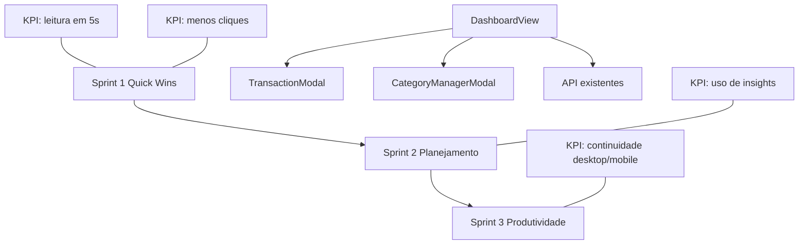

# Plano de Implementacao — Evolucao do Dashboard em 3 Sprints Curtas (Ciclo 9)

**Branch**: `009-evolucao-dashboard-ciclo-9`
**Data**: 2026-05-27
**Spec**: `specs/009-evolucao-dashboard-ciclo-9/spec.md`

## §0 Contexto de Negócio

- **Persona**: PO/usuario unico com operacao diaria.
- **Dor**: dashboard bom no core, mas com espaco para melhorar leitura instantanea e produtividade.
- **Valor**: entregar evolucao incremental sem ruptura de UX.
- **KPIs**:
  - leitura de saude em ate 5s.
  - menos cliques em tarefas frequentes.
  - mais uso de insights/alertas com acao.
  - continuidade desktop/mobile.
- **Restricoes**:
  - Sprint 1 sem redesign amplo.
  - manter consistencia com ciclo 8.
  - acessibilidade e responsividade obrigatorias por sprint.

## §1 Arquitetura

**Estratégia arquitetural**

- Priorizar evolucoes no `DashboardView` e subblocos locais, evitando mexer em fluxo global de navegacao.
- Introduzir componentes visuais menores (cards/blocos) de forma progressiva, sem quebrar semantica atual.
- Reusar dados ja carregados no dashboard e endpoints existentes sempre que possivel.

## §2 Componentes

| Arquivo                                          | Estado atual                                           | O que muda                                                  | Responsabilidade                          | Impacto de negócio            |
| ------------------------------------------------ | ------------------------------------------------------ | ----------------------------------------------------------- | ----------------------------------------- | ----------------------------- |
| `client/src/components/DashboardView.jsx`        | dashboard com cards, categorias, comparativos e listas | evolucao progressiva de blocos por sprint                   | orquestracao principal de UX do dashboard | maior leitura e produtividade |
| `client/src/components/DashboardView.test.jsx`   | cobertura existente parcial                            | adicionar cenarios por sprint                               | regressao e qualidade de UX funcional     | reduzir risco de quebra       |
| `client/src/components/TransactionModal.jsx`     | fluxo de criacao/edicao atual                          | integrar atalho/entrada de acoes rapidas sem redesign amplo | acao rapida recorrente                    | menos cliques                 |
| `client/src/components/CategoryManagerModal.jsx` | gerenciador de categorias lateral                      | integrar CTA de ajuste contextual quando aplicavel          | manutencao de categorias orientada a acao | fluidez operacional           |
| `client/src/util/*` (se necessario)              | utilitarios existentes                                 | pequenos helpers locais para microtendencia/insights        | manter logica isolada e testavel          | manutencao previsivel         |

## §3 Fluxo de Dados (caminho feliz)

### Sprint 1

1. Dashboard carrega dados correntes do mes.
2. Resumo executivo sintetiza sinais no topo (sem remover estrutura atual).
3. Cards mostram microtendencia e progresso visual padronizado.
4. Acoes rapidas disparam fluxos existentes (nova movimentacao, simulacao, categoria).

### Sprint 2

1. Dashboard monta card de proximos pagamentos com base em dados existentes/projecao simples.
2. Insights acionaveis sao renderizados com CTA contextual.
3. Quando sem dados, estados vazios guiados orientam proximo passo.

### Sprint 3

1. Navegacao por intencao reorganiza pontos de acao dentro do dashboard.
2. Lista de transacoes recebe refinamentos de eficiencia (legibilidade, agrupamento/acoes).
3. Ajustes finais de UX responsiva para continuidade entre desktop/mobile.

**Pontos criticos**

- Evitar densidade excessiva no topo no Sprint 1.
- Garantir que insights nao gerem ruido quando sinal fraco.
- Manter consistencia de foco, tab order e labels em cada incremento.

## §4 Validação e Erros

| Regra                       | Verificação                    | Resultado esperado                                |
| --------------------------- | ------------------------------ | ------------------------------------------------- |
| Sprint 1 sem redesign amplo | comparacao visual com baseline | evolucao incremental preservando identidade atual |
| Microtendencias coerentes   | dados do periodo ativo         | variacoes consistentes com cards existentes       |
| CTA acionavel               | clique em acao rapida/insight  | fluxo existente aberto corretamente               |
| Estados vazios guiados      | ausencia de dados              | orientacao clara sem bloqueio                     |
| Responsividade minima       | desktop + mobile               | sem overflow critico e com foco navegavel         |

## §5 Integrações Externas (se houver)

- Nenhuma nova integracao externa prevista.
- Reuso de endpoints e estrutura de dados atuais do dashboard.

## §6 Constitution Check

| Princípio                               | Resultado    | Justificativa                                           |
| --------------------------------------- | ------------ | ------------------------------------------------------- |
| I. Bounded Architecture                 | **Conforme** | foco em client/dashboard sem alterar fronteiras backend |
| II. Security by Default                 | **Conforme** | sem mudanca de auth/token/PII                           |
| III. Quality Gates Executáveis          | **Conforme** | validação por sprint com lint/build/test                |
| IV. Data Integrity                      | **Conforme** | indicadores mantem coerencia com dados existentes       |
| V. Operability e Observabilidade Segura | **Conforme** | estados de erro/vazio orientam acao sem colapso de UX   |

## §7 Trade-offs e Riscos

| Risco                                   | Impacto             | Mitigação concreta                                         |
| --------------------------------------- | ------------------- | ---------------------------------------------------------- |
| Escopo virar redesign amplo no Sprint 1 | atrasos e regressao | gate de sprint com criterio estrito de incrementalidade    |
| Excesso de informacao no topo           | leitura piora       | limitar elementos a sinais de alto impacto                 |
| Insights pouco confiaveis               | perda de confiança  | regras simples + CTA contextual + fallback em estado vazio |
| Regressao em interacoes existentes      | quebra operacional  | testes de regressao por sprint + rollout incremental       |
| Divergencia desktop/mobile              | UX inconsistente    | checklist responsivo obrigatorio em cada sprint            |

## §8 Decisões Arquiteturais (ADR-like)

### ADR-1 — Evolucao em 3 sprints com gate de aprovacao

- **Decisão**: entregar em ondas curtas com go/no-go por sprint.
- **Alternativas consideradas**: ciclo unico grande.
- **Justificativa**: reduz risco e valida valor continuamente.
- **Consequências**: exige checklist e criterios de aceite por sprint.

### ADR-2 — Sprint 1 orientado a quick wins sem redesign

- **Decisão**: preservar estrutura base do dashboard e evoluir hierarquia/acoes.
- **Alternativas consideradas**: reformulacao visual ampla imediata.
- **Justificativa**: restricao explicita do briefing + menor risco de regressao.
- **Consequências**: ganhos visuais graduais.

### ADR-3 — Reuso maximo de fluxos existentes

- **Decisão**: CTAs e refinamentos acionam fluxos existentes antes de criar novos blocos complexos.
- **Alternativas consideradas**: novos fluxos paralelos dedicados.
- **Justificativa**: reduz acoplamento e custo de manutencao.
- **Consequências**: dependencia de boa composicao no `DashboardView`.

## Estratégia de Validação por Sprint

### Sprint 1 — Quick Wins

- Validar leitura de saude em ate 5 segundos (teste manual guiado).
- Confirmar padrao visual de progresso e microtendencias consistentes.
- Confirmar acoes rapidas funcionando sem alterar fluxos de negocio.

### Sprint 2 — Planejamento

- Validar card de proximos pagamentos + insights com CTA.
- Validar estados vazios guiados para ausencia de dados.
- Verificar que aumento de informacao nao degrada legibilidade.

### Sprint 3 — Produtividade

- Validar melhoria de eficiencia em navegacao por intencao e lista de transacoes.
- Confirmar estabilidade UX desktop/mobile.
- Confirmar ausencia de regressao nos fluxos existentes.

## Critério Go/No-Go por Sprint

- **Go Sprint 1 -> 2**:
  - quick wins entregues sem redesign amplo.
  - quality gates verdes.
  - checklist manual Sprint 1 sem bloqueante.
- **Go Sprint 2 -> 3**:
  - card/insights/estados vazios aprovados pelo PO.
  - sem regressao funcional detectada.
  - qualidade tecnica aprovada.
- **Go Release Sprint 3**:
  - ganhos de produtividade validados.
  - responsividade e acessibilidade minimas aprovadas.
  - backlog de ajustes residuais classificado como nao bloqueante.
