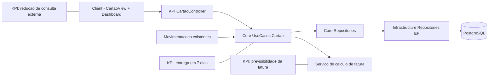

# Plano Tecnico: Cartao Visualizador sem Integracao Bancaria

Changelog breve (2026-06-01):

- limite de 1 cartao ativo por usuario formalizado no fluxo e validacoes.
- manutencao minima do MVP definida com editar e inativar cartao.
- regra diaFechamento < diaVencimento promovida para validacao obrigatoria.

Branch: 010-cartao-visualizador-sem-integracao
Data: 2026-06-01
Spec: specs/010-cartao-visualizador-sem-integracao/spec.md

## §0 Contexto de Negocio

- Persona: PO/usuario unico, com rotina diaria de controle financeiro.
- Dor: consulta fragmentada entre app financeiro e app bancario para limite/fatura.
- Valor: previsibilidade de cartao centralizada no app em modo manual.
- KPI-alvo:
  - reduzir consultas externas ao banco para verificacao de limite.
  - aumentar decisao de compra com base em limite disponivel no app.
  - entregar MVP utilizavel em 7 dias.
- Restricoes:
  - sem integracao bancaria.
  - sem dados sensiveis reais de cartao.
  - sem pagamento/processamento.

## §1 Arquitetura

Direcao arquitetural:

- Novo contexto funcional Cartao dentro do dominio financeiro, com regras isoladas.
- Reuso de movimentacoes existentes para vinculo com cartao e calculo de previsao.
- Sem alterar fronteiras de autenticacao ou infraestrutura de seguranca.

## §2 Componentes

| Arquivo                                                | Estado atual | O que muda                                                              | Responsabilidade                                       | Impacto de negocio           |
| ------------------------------------------------------ | ------------ | ----------------------------------------------------------------------- | ------------------------------------------------------ | ---------------------------- |
| server/Core/Domain/Cartao/CartaoManual.cs              | inexistente  | criar entidade de cartao manual                                         | representar configuracao de limite e ciclo             | base do modulo               |
| server/Core/Repositories/ICartaoRepository.cs          | inexistente  | criar porta de persistencia de cartao                                   | desacoplar dominio de EF                               | manter arquitetura limpa     |
| server/Core/UseCases/Cartao/\*                         | inexistente  | criar casos de uso de cadastro, consulta, edicao, inativacao e previsao | regras de negocio de limite/fatura e manutencao minima | previsibilidade para usuario |
| server/Infrastructure/Data/Configurations/\*           | parcial      | mapear entidade cartao e vinculo de lancamento                          | integridade em banco                                   | consistencia de dados        |
| server/Infrastructure/Repositories/CartaoRepository.cs | inexistente  | implementar repositorio EF                                              | persistencia concreta                                  | entrega MVP                  |
| server/API/Controllers/Cartao/CartaoController.cs      | inexistente  | expor endpoints do modulo cartao                                        | fronteira HTTP autenticada                             | usabilidade no client        |
| client/src/components/CardViewerView.jsx               | inexistente  | criar tela do modulo cartao                                             | UX do visualizador manual                              | reduzir trabalho manual      |
| client/src/components/TransactionModal.jsx             | existente    | permitir opcao de vincular compra ao cartao                             | capturar lancamento de cartao no fluxo atual           | adocao sem friccao           |
| client/src/services/api.js                             | existente    | adicionar chamadas REST do modulo cartao                                | contrato client-api                                    | integracao frontend/backend  |
| client/src/App.jsx                                     | existente    | incluir rota/aba para modulo cartao                                     | navegacao principal                                    | acessibilidade ao modulo     |

## §3 Fluxo de Dados (caminho feliz)

1. Usuario abre modulo Cartao e cadastra nome, limite, fechamento e vencimento.
2. API valida payload garantindo 1 cartao ativo por usuario e regra diaFechamento < diaVencimento.
3. API persiste CartaoManual sem dados sensiveis reais.
4. Usuario pode editar dados basicos do cartao ativo ou inativar o cartao no modulo.
5. Ao cadastrar movimentacao como compra de cartao, sistema vincula movimentacao ao cartao ativo.
6. Caso de uso de consulta agrega:
   - limite utilizado = soma das compras vinculadas no ciclo atual.
   - limite disponivel = limite total - limite utilizado.
   - percentual uso = limite utilizado / limite total.
7. Caso de uso de previsao separa compras em fatura atual ou proxima conforme dia de fechamento.
8. Client renderiza cards de limite e previsao com estado vazio guiado quando faltar dado.

Pontos criticos de latencia e seguranca:

- Calculo de fatura deve ser deterministico por data UTC e ciclo.
- Endpoint nao pode aceitar campos sensiveis fora do contrato.
- Vinculo de movimentacao de cartao nao deve alterar comportamento de movimentacoes nao-cartao.

## §4 Validacao e Erros

| Verificacao                              | Codigo de erro                | Status HTTP | Ordem | Justificativa de negocio                     |
| ---------------------------------------- | ----------------------------- | ----------- | ----- | -------------------------------------------- |
| Limite total <= 0                        | CARTAO_LIMITE_INVALIDO        | 400         | 1     | evitar previsao irreal                       |
| Dia fechamento fora de 1..31             | CARTAO_FECHAMENTO_INVALIDO    | 400         | 2     | manter ciclo valido                          |
| Dia vencimento fora de 1..31             | CARTAO_VENCIMENTO_INVALIDO    | 400         | 3     | evitar exibicao ambigua                      |
| Dia fechamento >= dia vencimento         | CARTAO_CICLO_INCONSISTENTE    | 400         | 4     | garantir previsao deterministica no MVP      |
| Novo cadastro com cartao ativo existente | CARTAO_ATIVO_JA_EXISTE        | 409         | 5     | reforcar regra de 1 cartao ativo por usuario |
| Campo sensivel detectado no payload      | CARTAO_DADO_SENSIVEL_PROIBIDO | 400         | 6     | cumprir restricao de seguranca               |
| Cartao nao encontrado                    | CARTAO_NAO_ENCONTRADO         | 404         | 7     | feedback claro ao usuario                    |
| Movimentacao sem permissao do usuario    | MOVIMENTACAO_ACESSO_NEGADO    | 403         | 8     | isolamento por usuario                       |

## §5 Integracoes Externas

- Nao ha integracoes externas novas no MVP.
- Toda informacao de cartao vem de input manual do usuario e de movimentacoes locais do sistema.
- Trade-off: menor automacao, maior velocidade de entrega e menor risco de compliance no prazo de 7 dias.

## §6 Constitution Check

| Principio                               | Resultado | Evidencia                                                           |
| --------------------------------------- | --------- | ------------------------------------------------------------------- |
| I. Bounded Architecture                 | Conforme  | repositorio via interface no Core + implementacao em Infrastructure |
| II. Security by Default                 | Conforme  | bloqueio de campos sensiveis e sem integracao bancaria              |
| III. Quality Gates Executaveis          | Conforme  | lint/build/test aplicaveis por etapa                                |
| IV. Data Integrity                      | Conforme  | decimal para valores, UTC para datas, migration reversivel          |
| V. Operability e Observabilidade Segura | Conforme  | mensagens de erro acionaveis e logs sem PII/cartao sensivel         |

## §7 Trade-offs e Riscos

| Risco                                          | Tipo      | Impacto            | Mitigacao                                                             |
| ---------------------------------------------- | --------- | ------------------ | --------------------------------------------------------------------- |
| Usuario esquecer lancamentos manuais           | Produto   | previsao incorreta | UX de lancamento rapido + estado vazio guiado + copy educativa        |
| Expectativa de sincronizacao bancaria          | Produto   | frustracao         | mensagem explicita em onboarding do modulo                            |
| Regras de ciclo de fatura em meses curtos      | Tecnico   | calculo divergente | funcao central de normalizacao de datas + testes de fevereiro/30 dias |
| Vazamento de campo sensivel em payload         | Seguranca | nao conformidade   | validacao server-side denylist + DTO estrito                          |
| Prazo de 7 dias insuficiente para multi-cartao | Escopo    | atraso             | formalizar regra de 1 cartao ativo por usuario no MVP                 |
| Regressao em movimentacoes existentes          | Tecnico   | quebra funcional   | feature flag simples no client + testes de regressao do modal         |

## §8 Decisoes Arquiteturais

### Decisao 1: MVP com 1 cartao ativo por usuario (requisito funcional)

- Alternativas consideradas: multi-cartao desde o primeiro ciclo.
- Justificativa tecnica: reduz complexidade de agregacoes e UX no prazo curto.
- Justificativa de negocio: prioriza valor principal (previsibilidade) em 7 dias.
- Consequencias: cadastro concorrente bloqueado por regra funcional e backlog explicito para multi-cartao no proximo ciclo.

### Decisao 2: Reuso de movimentacoes para compras de cartao

- Alternativas consideradas: criar entidade de compra separada no MVP.
- Justificativa tecnica: menor retrabalho e risco de regressao.
- Justificativa de negocio: acelera adocao sem ensinar fluxo novo completo.
- Consequencias: necessidade de campo de vinculo de cartao na movimentacao.

### Decisao 3: Sem integracao bancaria no MVP

- Alternativas consideradas: Open Finance parcial.
- Justificativa tecnica: alta complexidade e dependencia externa.
- Justificativa de negocio: evita estourar prazo e reduz risco regulatorio.
- Consequencias: fluxo manual com comunicacao clara de escopo.

## Estratégia de migracao de dados

1. Criar migration para tabela de cartao manual e eventual tabela de vinculo com movimentacao.
2. Garantir campos monetarios como numeric e datas em UTC.
3. Script de rollback da migration no mesmo PR.
4. Backfill opcional: nenhuma carga inicial obrigatoria para MVP.

## Sequencia incremental de entrega (7 dias)

1. Dia 1-2: dominio, repository interfaces, migration e endpoint de cadastro/consulta de cartao.
2. Dia 3-4: vinculo de movimentacao ao cartao + calculo de limite e previsao de fatura + validacao de ciclo.
3. Dia 5: tela de visualizador no frontend + manutencao minima (editar/inativar) + estados vazios + comunicacao de modo manual.
4. Dia 6: testes de regressao e acessibilidade minima.
5. Dia 7: hardening, checklist manual e decisao go/no-go do MVP.

## Criterio Go/No-Go do MVP

Go:

- cadastro de cartao funcional com validacoes de ciclo.
- regra de 1 cartao ativo por usuario respeitada em cadastro/edicao/inativacao.
- limite usado/disponivel e previsao atual/proxima corretos em cenarios de teste.
- nenhuma persistencia de dados sensiveis reais de cartao.
- quality gates aplicaveis verdes (backend build, frontend lint/build/test).
- checklist manual de fluxo principal aprovado sem bloqueante.

No-Go:

- qualquer erro de calculo de limite/fatura em cenario basico.
- qualquer evidencia de campo sensivel aceito/persistido.
- regressao bloqueante no fluxo de movimentacoes existente.
- falha de gates sem mitigacao aprovada.
