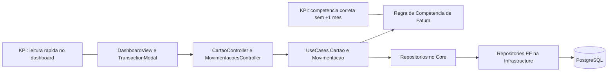

# Plano Tecnico: Cartao no Dashboard e Competencia Correta da Fatura

Branch: 011-cartao-dashboard-competencia-fatura
Data: 2026-06-01
Spec: specs/011-cartao-dashboard-competencia-fatura/spec.md

## §0 Contexto de Negocio

- Persona: PO/usuario unico com objetivo de escalar a experiencia para novos usuarios.
- Dor: falta de visibilidade rapida do cartao no dashboard e competencia incorreta por uso de vencimento como data.
- Valor:
  - decisao rapida com resumo operacional de cartao no dashboard.
  - confiabilidade da competencia de fatura para compras novas.
- KPI-alvo:
  - reduzir retrabalho manual para leitura de fatura/limite.
  - eliminar efeito de deslocamento indevido de mes em compras novas.
- Restricoes:
  - sem integracao bancaria.
  - sem migracao de historico antigo.
  - sem quebra de fluxo nao-cartao.

## §1 Arquitetura

Direcao arquitetural:

- Dashboard recebe camada de resumo operacional de cartao sem substituir tela dedicada de gestao.
- Regra de competencia e centralizada no backend para garantir determinismo.
- Fluxo nao-cartao permanece no caminho atual, sem dependencia da regra de cartao.

## §2 Componentes

| Arquivo                                           | Estado atual                                      | O que muda                                                            | Responsabilidade                    | Impacto de negocio                 |
| ------------------------------------------------- | ------------------------------------------------- | --------------------------------------------------------------------- | ----------------------------------- | ---------------------------------- |
| client/src/components/DashboardView.jsx           | dashboard sem card operacional completo de cartao | adicionar card de cartao com indicadores e acoes rapidas              | leitura e acao rapida               | maior velocidade de decisao        |
| client/src/components/TransactionModal.jsx        | fluxo de transacao com suporte parcial a cartao   | garantir captura de data real da compra e cartao selecionado          | entrada correta de compra no cartao | competencia correta                |
| client/src/services/api.js                        | endpoints gerais existentes                       | adicionar/ajustar contrato de resumo de cartao para dashboard         | comunicacao client-api              | estabilidade de dados no dashboard |
| server/API/Controllers/Cartao/CartaoController.cs | modulo cartao base do ciclo 010                   | expor endpoint de resumo operacional para dashboard                   | fronteira HTTP do resumo            | centralizacao de informacao        |
| server/Core/UseCases/Cartao/\*                    | casos de uso base existentes                      | incluir regra formal de competencia para novas compras                | regra de negocio deterministica     | elimina distorcao mensal           |
| server/API/Controllers/Movimentacao/\*            | fluxo atual de movimentacao                       | garantir que compra no cartao persista data real e cartao selecionado | entrada de dados financeiros        | integridade de competencia         |
| server/Infrastructure/Repositories/\*             | persistencia atual                                | ajustar consulta de competencia para novas compras                    | persistencia e agregacao            | previsao de fatura confiavel       |

## §3 Fluxo de Dados (caminho feliz)

1. Dashboard solicita resumo de cartao.
2. Backend retorna fatura atual, proxima, limite total/usado/disponivel, fechamento e vencimento.
3. Usuario aciona nova compra pelo card de cartao no dashboard.
4. TransactionModal abre com contexto de cartao, mantendo opcao de transacao nao-cartao intacta.
5. Ao salvar compra no cartao:
   - dataMovimentacao = data real da compra informada pelo usuario.
   - cartaoSelecionado e persistido no lancamento.
6. Use case calcula competencia:
   - se dia(dataCompra) <= diaFechamento - 1: fatura atual.
   - se dia(dataCompra) >= diaFechamento: fatura proxima.
7. Dashboard atualiza resumo e reflete impacto no limite e previsao.

Pontos criticos:

- Regra de competencia aplicada apenas a novos lancamentos.
- Nenhum recalculo automatico do historico antigo.
- Fluxo nao-cartao sem alteracao de comportamento.

## §4 Validacao e Erros

| Verificacao                                                               | Codigo de erro                          | Status HTTP | Ordem | Justificativa de negocio            |
| ------------------------------------------------------------------------- | --------------------------------------- | ----------- | ----- | ----------------------------------- |
| Compra cartao sem cartao selecionado                                      | CARTAO_NAO_SELECIONADO                  | 400         | 1     | evitar compra sem referencia valida |
| Data de compra ausente/invalida                                           | DATA_COMPRA_INVALIDA                    | 400         | 2     | garantir competencia correta        |
| Tentativa de usar vencimento como data de compra automatica               | DATA_COMPRA_DIVERGENTE                  | 400         | 3     | impedir regressao de regra antiga   |
| Cartao inativo/inexistente                                                | CARTAO_INATIVO_OU_NAO_ENCONTRADO        | 404         | 4     | manter integridade do vinculo       |
| Tentativa de aplicar regra nova em historico antigo via rotina automatica | HISTORICO_REPROCESSAMENTO_NAO_PERMITIDO | 409         | 5     | preservar escopo do ciclo           |

## §5 Integracoes Externas

- Nenhuma integracao externa nova.
- Sem open finance e sem sincronizacao bancaria.
- Trade-off: entrada manual em troca de previsibilidade e entrega com risco controlado.

## §6 Constitution Check

| Principio                               | Resultado | Evidencia                                                                |
| --------------------------------------- | --------- | ------------------------------------------------------------------------ |
| I. Bounded Architecture                 | Conforme  | regra no Core, APIs na camada de entrega, persistencia em Infrastructure |
| II. Security by Default                 | Conforme  | sem dados sensiveis reais e sem novas superficies de auth                |
| III. Quality Gates Executaveis          | Conforme  | build backend + lint/build/test frontend no ciclo                        |
| IV. Data Integrity                      | Conforme  | competencia deterministica baseada em data real de compra                |
| V. Operability e Observabilidade Segura | Conforme  | estados vazios e erros claros no dashboard/modal                         |

## §7 Trade-offs e Riscos

| Risco                                           | Tipo    | Impacto               | Mitigacao                                           |
| ----------------------------------------------- | ------- | --------------------- | --------------------------------------------------- |
| Dashboard ficar visualmente carregado           | Produto | queda de usabilidade  | limitar card a indicadores essenciais e CTAs curtos |
| Usuario confundir data de compra com vencimento | Produto | erro de competencia   | copy explicativa no modal e validacao obrigatoria   |
| Divergencia em meses curtos                     | Tecnico | calculo inconsistente | testes de borda com 28/29/30/31 dias                |
| Regressao no fluxo nao-cartao                   | Tecnico | quebra operacional    | testes de regressao especificos no modal            |
| Expectativa de ajuste retroativo do historico   | Produto | frustracao            | comunicacao explicita de escopo sem migracao        |

## §8 Decisoes Arquiteturais

### Decisao 1: Card de cartao no dashboard como resumo operacional

- Alternativas consideradas: manter cartao apenas na tela dedicada.
- Justificativa tecnica: reutiliza dados existentes com baixo acoplamento.
- Justificativa de negocio: atende necessidade de leitura rapida diaria.
- Consequencias: exige controle de densidade visual no dashboard.

### Decisao 2: Competencia baseada em data real de compra

- Alternativas consideradas: manter vencimento como referencia principal.
- Justificativa tecnica: elimina ambiguidade de competencia.
- Justificativa de negocio: corrige deslocamento indevido de despesas para +1 mes.
- Consequencias: demanda copy/validacao para evitar preenchimento errado no modal.

### Decisao 3: Aplicacao apenas para novos lancamentos

- Alternativas consideradas: reprocessar historico automaticamente.
- Justificativa tecnica: evita alto risco de inferencia incorreta.
- Justificativa de negocio: reduz prazo e risco no ciclo atual.
- Consequencias: historico legado permanece como esta e deve ser documentado.

## Estratégia de validacao da competencia

1. Construir matriz de cenarios com datas antes/no/depois do fechamento.
2. Validar em meses de 31, 30 e 28/29 dias.
3. Confirmar que regra nova so incide em novos lancamentos.
4. Confirmar que dashboard reflete valores atualizados apos nova compra.

## Sequencia incremental

1. Backend: consolidar regra de competencia e contratos de resumo de cartao.
2. API: expor endpoints/DTOs para card do dashboard e fluxo de compra.
3. Frontend: renderizar card no dashboard com acoes rapidas.
4. Frontend modal: reforcar captura da data real e cartao selecionado.
5. Testes e hardening: regressao nao-cartao + cenarios de virada da fatura.

## Criterio Go/No-Go

Go:

- card de cartao visivel no dashboard com todos os campos mandatarios.
- regra de virada aplicada corretamente para compras novas.
- historico antigo intacto.
- fluxo nao-cartao sem regressao.
- quality gates aprovados.

No-Go:

- qualquer compra nova ainda usando vencimento como data efetiva de movimentacao.
- regressao bloqueante no fluxo nao-cartao.
- tentativa de migracao/reprocessamento de historico fora de escopo.
- quality gates falhando sem mitigacao aprovada.
