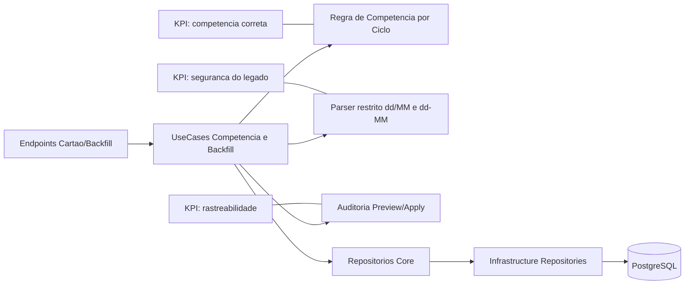

# Plano Tecnico: Hotfix de Competencia do Cartao e Correcao Segura do Legado

Branch: 012-hotfix-competencia-cartao-correcao-legado
Data: 2026-06-01
Spec: specs/012-hotfix-competencia-cartao-correcao-legado/spec.md

## §0 Contexto de Negocio

- Persona: PO/usuario unico em validacao real de producao.
- Dor:
  - competencia incorreta em ciclos cruzando meses.
  - distorcao no legado por datas de vencimento gravadas como data de compra.
- Valor:
  - competencia correta em todos os cenarios de ciclo valido.
  - backfill seguro com preview e sem alteracoes cegas.
- KPI-alvo:
  - 100% dos cenarios criticos de virada com competencia correta.
  - 0 alteracoes automaticas em casos ambiguos.
  - 0 alteracoes em registros nao-cartao.
- Restricoes:
  - preview obrigatorio antes de apply.
  - parser apenas dd/MM e dd-MM.
  - sem regressao no fluxo nao-cartao.

## §1 Arquitetura

Direcao arquitetural:

- regra de competencia e validacao de ciclo centralizadas no Core para evitar divergencia entre clientes.
- backfill implementado como fluxo controlado em dois modos: preview e apply.
- apply proibido sem executionId de preview valido.

## §2 Componentes

| Arquivo                                    | Estado atual            | O que muda                                                     | Responsabilidade             | Impacto de negocio         |
| ------------------------------------------ | ----------------------- | -------------------------------------------------------------- | ---------------------------- | -------------------------- |
| server/Core/UseCases/Cartao/\*             | regra parcial existente | ajustar competencia por ciclo cruzando mes                     | corretude da fatura          | elimina distorcao mensal   |
| server/Core/UseCases/Cartao/Backfill\*     | inexistente/parcial     | criar casos de uso preview/apply do legado                     | seguranca da correcao        | evita alteracao cega       |
| server/Core/Domain/Cartao/\*               | validacao simplificada  | permitir ciclo valido com fechamento > vencimento              | refletir ciclo real          | reduz bloqueio indevido    |
| server/API/Controllers/Cartao/\*           | endpoints base          | adicionar endpoints de preview/apply com auditoria             | operacao do hotfix           | controle e rastreabilidade |
| server/Infrastructure/Repositories/\*      | consultas atuais        | filtrar apenas lancamentos cartao no backfill                  | isolamento de escopo         | protege nao-cartao         |
| client/src/components/DashboardView.jsx    | card cartao existente   | sem mudanca estrutural; validar reflexo correto de competencia | leitura de impacto do hotfix | confianca do usuario       |
| client/src/components/TransactionModal.jsx | fluxo atual             | reforcar mensagem de data real de compra no cartao             | prevencao de erro humano     | menor retrabalho           |

## §3 Fluxo de Dados (caminho feliz)

### Competencia de compra nova

1. Usuario salva compra no cartao com data real.
2. Use case resolve ciclo de competencia considerando janela entre fechamentos consecutivos.
3. Regra de virada mantida:
   - compra no dia de fechamento ou apos: proxima fatura.
   - compra antes do fechamento: fatura atual.
4. Resultado persiste competencia correta e atualiza resumo.

### Backfill de legado

1. Operador executa preview para periodo-alvo.
2. Sistema seleciona somente lancamentos marcados como cartao.
3. Parser tenta extrair data da descricao apenas nos formatos dd/MM ou dd-MM.
4. Preview classifica cada item em aplicavel, ambiguo ou ignorado e gera executionId.
5. Operador revisa relatorio e confirma apply usando executionId.
6. Apply altera apenas itens aplicaveis daquele preview e registra auditoria.

## §4 Validacao e Erros

| Verificacao                                   | Codigo de erro               | Status HTTP | Ordem | Justificativa de negocio        |
| --------------------------------------------- | ---------------------------- | ----------- | ----- | ------------------------------- |
| Ciclo invalido estrutural (dia fora de 1..31) | CARTAO_CICLO_INVALIDO        | 400         | 1     | impedir configuracao impossivel |
| Parser sem data em formato permitido          | BACKFILL_DATA_NAO_ENCONTRADA | 200         | 2     | item ignorado de forma segura   |
| Parser com multiplas datas validas            | BACKFILL_DATA_AMBIGUA        | 200         | 3     | evitar inferencia agressiva     |
| Apply sem preview previo                      | BACKFILL_PREVIEW_OBRIGATORIO | 409         | 4     | cumprir seguranca operacional   |
| Apply com executionId invalido/expirado       | BACKFILL_EXECUTION_INVALIDA  | 409         | 5     | evitar lote indevido            |
| Tentativa de incluir nao-cartao no backfill   | BACKFILL_ESCOPO_INVALIDO     | 400         | 6     | preservar restricao de escopo   |

## §5 Integracoes Externas

- nenhuma integracao externa nova.
- sem open finance e sem sincronizacao bancaria.
- hotfix opera exclusivamente em dados internos existentes.

## §6 Constitution Check

| Principio                               | Resultado | Evidencia                                                       |
| --------------------------------------- | --------- | --------------------------------------------------------------- |
| I. Bounded Architecture                 | Conforme  | regra e parser no Core; adapters na Infrastructure/API          |
| II. Security by Default                 | Conforme  | sem dados sensiveis reais e sem exposicao desnecessaria em logs |
| III. Quality Gates Executaveis          | Conforme  | build/lint/test aplicados ao escopo                             |
| IV. Data Integrity                      | Conforme  | competencia deterministica + rollback + auditoria               |
| V. Operability e Observabilidade Segura | Conforme  | preview por status e auditoria de execucao                      |

## §7 Trade-offs e Riscos

| Risco                                           | Tipo        | Impacto                      | Mitigacao                                              |
| ----------------------------------------------- | ----------- | ---------------------------- | ------------------------------------------------------ |
| Bloquear fechamento>vencimento por regra antiga | Produto     | cartoes reais inviabilizados | ajustar validacao para ciclo, nao comparacao fixa      |
| Parser identificar data errada                  | Tecnico     | correcao incorreta           | restringir formato + classificar ambiguo como ignorado |
| Apply em lote sem revisao                       | Operacional | impacto massivo              | preview obrigatorio + executionId vinculado            |
| Sem rollback rapido                             | Operacional | demora de recuperacao        | plano de rollback antes de apply                       |
| Regressao nao-cartao                            | Tecnico     | quebra de fluxo principal    | filtro estrito de escopo + testes de regressao         |

## §8 Decisoes Arquiteturais

### Decisao 1: Competencia por ciclo e nao por comparacao simplista no mesmo mes

- Alternativas consideradas: manter fechamento < vencimento obrigatorio.
- Justificativa tecnica: comparacao simples invalida ciclos reais cruzando meses.
- Justificativa de negocio: viabiliza cenarios comuns (29/5) sem erro funcional.
- Consequencias: algoritmo de competencia baseado em janela de ciclo.

### Decisao 2: Backfill em duas fases (preview -> apply)

- Alternativas consideradas: apply direto.
- Justificativa tecnica: reduz risco de alteracao indevida em lote.
- Justificativa de negocio: aumenta confianca e governanca da correcao.
- Consequencias: operacao requer etapa adicional obrigatoria.

### Decisao 3: Parser conservador restrito a dd/MM e dd-MM

- Alternativas consideradas: parser com heuristicas amplas.
- Justificativa tecnica: minimiza falso positivo.
- Justificativa de negocio: evita correcoes erradas no legado.
- Consequencias: mais itens podem cair em ignorado para ajuste manual.

## Estratégia de rollback e observabilidade

1. Registrar snapshot dos IDs/data antiga/data nova para cada item aplicavel.
2. Disponibilizar comando de rollback por executionId (somente para apply concluido).
3. Logar metricas por execucao:
   - total analisado
   - total aplicavel
   - total ambiguo
   - total ignorado
   - total aplicado
   - total revertido
4. Expor resumo de execucao para auditoria operacional.

## Sequencia incremental

1. Ajustar validacao de ciclo e regra de competencia no backend.
2. Criar parser restrito e fluxo de preview com classificacao.
3. Criar fluxo de apply com precondicao de preview e trilha de auditoria.
4. Criar rollback por executionId.
5. Validar regressao de nao-cartao e atualizar feedback no modal/dashboard.

## Criterio Go/No-Go

Go:

- ciclo 29/5 validado com competencia correta.
- preview obrigatorio funcionando com relatorio por status.
- apply alterando apenas aplicaveis e apenas cartao.
- rollback executavel por executionId.
- sem regressao no fluxo nao-cartao.
- quality gates aprovados.

No-Go:

- qualquer alteracao sem preview.
- qualquer ajuste automatico em item ambiguo.
- qualquer alteracao em lancamento nao-cartao.
- ausencia de trilha auditavel ou rollback testado.
- falha em quality gates sem mitigacao aprovada.
